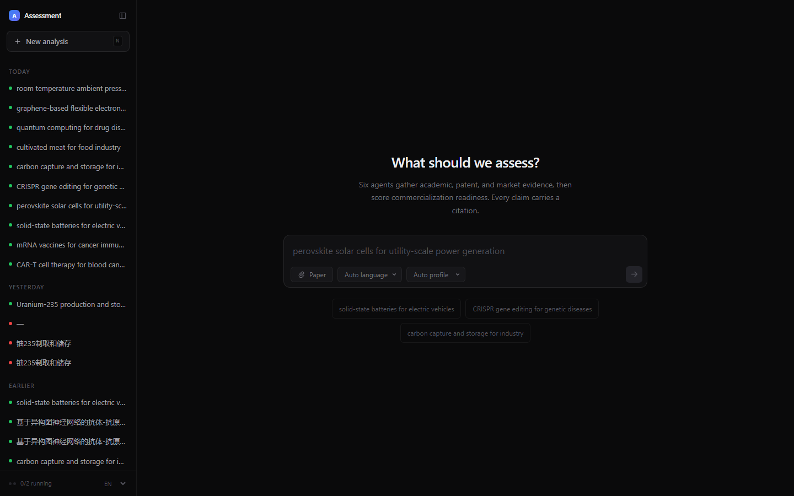
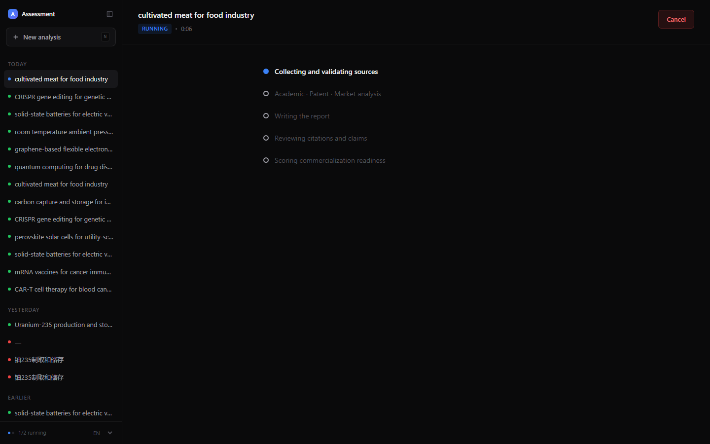
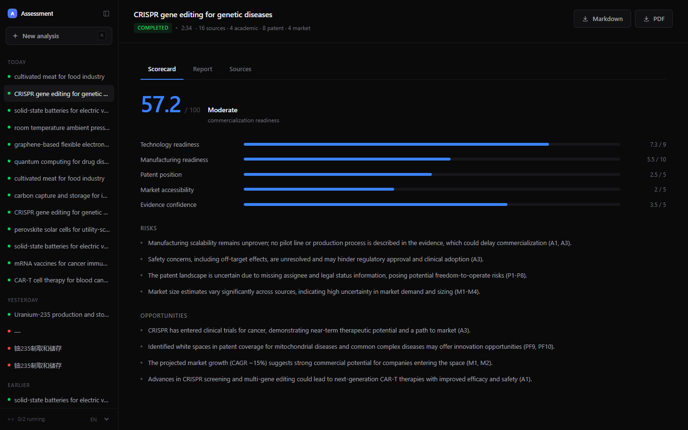

# Academic Commercialization Assessment Agent

> **Turn any research paper or topic into a commercialization readiness report in minutes** — six AI agents gather academic, patent, and market evidence, then produce a scored report with verifiable citations.

[](https://github.com/shuxiachai/academic-commercialization-agent/actions/workflows/test.yml)
[](LICENSE)
[](https://www.python.org/downloads/)
[](https://github.com/crewAIInc/crewAI)

[](https://academic-commercialization-agent.up.railway.app)

[Portfolio case study](docs/portfolio-case-study.md) | [90-second demo guide](docs/demo-script-90s.md) | [v2.0.0 release notes](docs/release-v2.0.0.md)

[English](#english) | [中文](#chinese)

---

<a name="english"></a>

## English

A multi-agent system built on [CrewAI](https://github.com/crewAIInc/crewAI) that evaluates the commercialization readiness of academic research.

Input a research direction or paper topic. Six specialized AI agents automatically gather evidence from academic literature, patent databases, and market intelligence sources, then produce a structured commercialization assessment report with verifiable citations and a quantitative scorecard.

An optional Decision Context adds the asset, application, decision owner and
decision being considered. Topic-only and partial-context runs remain valid,
but explicitly stay in orientation mode instead of presenting actor-specific
GO/NO_GO advice as if the missing decision boundary had been established.

---

### Try it online

**https://academic-commercialization-agent.up.railway.app**

Running on Railway — nothing to install. The gate offers two ways in:

- **Bring your own API keys** — no access code needed. Pick your LLM provider,
  paste an LLM key and a search key, and the run is billed to you. The keys go
  only into that one run's subprocess environment: never written to disk, never
  merged into the server's own environment, never visible to another run
  happening at the same time, and gone when you close the tab.
- **Access code** — runs on the deployment's own keys. Codes are handed out
  privately; without one, use the BYOK option above.

A full run takes roughly 3 minutes and costs a few cents of LLM plus about 9
search queries. The deployment therefore caps shared paid-operation concurrency
and daily operator-funded admissions per code, including PDF extraction. See
[Deploying publicly](#deploying-publicly) for the exact boundary.

---

### Screenshots



<details>
<summary>▶ Analysis in progress — live agent status + source list</summary>
<br>

</details>

<details>
<summary>▶ Full results — scorecard, radar chart, and complete report</summary>
<br>

</details>

---

### Measured results

The frozen baseline exercises live retrieval and the complete six-agent
pipeline: **10 topics × 3 live repetitions**. The row-level evidence is committed in
[`benchmark_summary.csv`](outputs/benchmark/benchmark_summary.csv).

| Metric | Result |
|---|---|
| End-to-end completion | **30/30** |
| TRL calibration | **26/30** |
| Weighted formula correctness | **30/30** |
| Complete report structure | **30/30** |
| Unsupported numeric lines | **0 across 30 reports** |

TRL calibration compares the scorecard with milestone-anchored ranges whose
public events can be checked independently. It is calibration evidence, not a
blinded held-out accuracy score: the ranges were revised after earlier scores
had been observed. The numeric-line check is a citation-risk proxy, not a claim
that every possible form of hallucination has been eliminated.

A separate pre-registered topology ablation held evidence, model and report
contract constant across **1-node, 4-node and 6-node workflows** for 10 topics
with 3 repetitions each (90 paid cells). The 4-node workflow used **54.89% fewer
median tokens and 47.03% lower median cost** than the production 6-node workflow,
while substantially reducing contract violations and unsupported numeric lines
relative to the monolith. This supports domain decomposition, but does not by
itself justify every production stage. The follow-up blinded Reviewer audit is
now complete: both evaluator forms passed the frozen criterion across all nine
report pairs. Each preferred the reviewed report in 7/9 pairs; exact agreement
was 9/9 for overall preference, 8/9 for citation support, 3/9 for decision
usefulness, and 7/9 for the harmful-version label. This provisionally supports
retaining Reviewer, while the low decision-usefulness agreement and method
limitations rule out a broader user-value claim. Protocols, results, and full
caveats are in the
[topology ablation](docs/prereg-2026-08-21-agent-topology-ablation.md),
[Reviewer pre-registration](docs/prereg-2026-08-22-reviewer-value-audit.md), and
[Reviewer result](docs/results-2026-08-23-reviewer-value-audit.md) documents.

A separate pre-registered user-utility audit is now complete: five reviewers
made **20 eligible blinded judgments** over ten matched full/monolith pairs and
two independently assigned rounds, with no new model calls. Both rounds
reproduced a 6/10 versus 4/10 full-workflow advantage in overall preference and
decision usefulness, but both **failed the pre-registered criterion** because
the monolith was allowed at most 2/10 wins. Across both rounds the monolith led
information gain 11/20 to 5/20, and only 2/10 topics selected the same topology
across reviewers. The result is a small proxy-user study with one target user,
not adoption or proof that six agents are necessary. See the
[protocol](docs/prereg-2026-08-22-user-utility-audit.md),
[audit guide](docs/user-utility-audit-guide.md), and
[full result](docs/results-2026-08-23-user-utility-audit.md).

Because that denominator is closed and contained only one actual target user,
a separate **two-slot target-user decision pilot** was pre-registered and has
now completed without any provider calls. Both eligible target users selected
topic 08 before seeing a report, read the same frozen 2026-08-21 artifact, and
consented to anonymous aggregate publication. Both retained `DEFER` while
confidence rose from 3/5 to 4/5. Median decision usefulness and information
gain were 3/5; actionability, evidence trust, and recommendation acceptance were
2/5. Both answered `MAYBE` to reuse, estimated 420 minutes of revision work at
the median, and disagreed on whether the report contained a decision-blocking
error. Neither opened external sources, so source truth remains not evaluated.
The raw Stage 2 value `no` was preserved and owner-coded to schema value `NONE`
for both reviewers. These are two descriptive observations, not adoption, ROI,
accuracy, or population-level product validation. See the
[pre-registration](docs/prereg-2026-08-26-target-user-decision-pilot.md) and
[operator guide](docs/target-user-decision-pilot-guide.md), plus the
[form-timing erratum](docs/errata-2026-08-26-target-user-pilot-form-enums-and-ai-timing.md)
and [full result](docs/results-2026-08-26-target-user-decision-pilot.md).

That feedback led to a separately pre-registered, zero-provider Decision
Context implementation. Seven bounded fields now flow through the browser,
API, immutable RunSpec, checkpoint identity, Crew input, and public status. The
code distinguishes orientation, incomplete context, and decision support;
Writer/Reviewer must withhold actor-specific GO/NO_GO when the four core fields
are absent. This is an offline contract result, not evidence that a generated
decision is correct or useful. See the [protocol](docs/prereg-2026-08-26-decision-context-report-contract.md)
and [implementation result](docs/results-2026-08-26-decision-context-report-contract.md).
A separate [three-mode production canary](docs/prereg-2026-08-26-decision-context-paid-canary.md)
then completed three sequential root runs for **$0.109342**, 266,648 tokens,
and 21 provider requests. All reached `completed`, exposed the expected public
mode gates, created no child, and made zero evidence-gap tool calls. The frozen
primary criterion nevertheless **failed 7/10**: `DC01` used Reviewer fallback
and committed 6/7 checkpoints, `DC03` humanized the required mode token, and
`DC02` introduced an unqualified commercial pass threshold that its incomplete
context had not established. This is provider-backed prompt-compliance and
operational evidence, not source truth, decision correctness, or user value.
See the [full canary result](docs/results-2026-08-26-decision-context-paid-canary.md).

A zero-network follow-up now persists the immutable worker
`pipeline_revision` in each new run and exposes that exact value through both
status endpoints. Historical runs return `null`; the API never backfills them
from the currently serving deployment. This repairs future execution
attribution but does not retrospectively identify or change the frozen canary.
See the [boundary result](docs/results-2026-08-27-public-pipeline-revision-seam.md).

A separate pre-registered checkpoint audit hard-terminated **30 worker
processes** across ten frozen evidence collections and three post-commit
boundaries. All 30 immutable children reached `Done`, reused exactly the
expected contiguous prefix, and executed exactly the remaining suffix; **90
committed task executions were skipped with 0 duplicate task executions**.
This is zero-network evidence for recovery mechanics, not a real-provider cost,
latency, exactly-once, or Railway SLO result. See the
[protocol](docs/prereg-2026-08-23-checkpoint-fault-recovery.md),
[result](docs/results-2026-08-23-checkpoint-fault-recovery.md), and
[sanitized 30-row evidence](evals/checkpoint_recovery/checkpoint-fault-recovery-offline-v1.csv).

A later pre-registered Railway canary reached a same-revision four-node prefix
and restarted the production service without a rebuild. The failed source
retained that exact prefix, but the only recovery request was rejected by the
three-operation daily paid cap before a child or provider call began. This is a
**non-pass**, not evidence of paid checkpoint reuse: it verifies production
restart persistence and fail-closed admission only. The source checkpoint
manifests stored no usage values, so partial tokens and cost remain
`not_inspectable`. See the
[protocol](docs/prereg-2026-08-24-paid-same-revision-recovery.md) and
[result](docs/results-2026-08-24-paid-same-revision-recovery.md).

An independently pre-registered second-code follow-up then admitted a child on
the same revision and reused the exact four-node prefix. The three evidence
agents made **0 new child requests**; only the Writer ran. The child still
failed because recovery restored validated evidence JSON into
`TaskOutput.raw` without reconstructing the typed `EvidenceReport` values
that the report guardrail uses to build its source registry. This is direct
paid evidence for prefix reuse, but another **non-pass** for complete recovery.
The child used 31,642 tokens across two Writer requests at an estimated
$0.014576; interrupted-source usage is uninspectable, so this is not a total
cost or savings claim. See the
[follow-up protocol](docs/prereg-2026-08-24-paid-same-revision-recovery-follow-up.md)
and [result](docs/results-2026-08-24-paid-same-revision-recovery-follow-up.md).

The recovery adapter now reconstructs reused evidence JSON as typed
`EvidenceReport` objects only after repeating schema and evidence-integrity
validation. Two zero-network regressions exercise the actual Writer guardrail
seam and fail closed on schema-invalid evidence checkpoints. This repairs the
observed raw-only hydration path without changing CrewAI's raw model context.

A separately pre-registered post-fix Railway canary has now completed the
end-to-end path. After the same deployed revision was restarted with a
four-node prefix, the only immutable child reported `recovery.state=reused`,
made **0 new evidence-agent requests**, completed Writer, Reviewer, and Scorer,
served a 33,081-byte report, and committed all seven checkpoints without an
error. The child recorded 88,780 tokens across four suffix requests at an
estimated $0.033593. Interrupted-source usage remains `not_inspectable`, so
that value is neither total experiment cost nor a general savings claim. This
is one successful production canary, not a recovery rate, SLO, or exactly-once
result. See the [post-fix protocol](docs/prereg-2026-08-24-paid-same-revision-recovery-post-fix.md)
and [result](docs/results-2026-08-24-paid-same-revision-recovery-post-fix.md).

The zero-network operational audit reads the run directories already on disk:

```bash
uv run python ops_report.py
uv run python ops_report.py --since 2026-08-01
```

It reports five outcomes separately: completed, failed, timed out, cancelled,
and unknown. Resolved success rates exclude user cancellations and unknown
directories; unknown is never promoted to success merely because no error
could be read. Legacy directories without `status.json` remain visible when
a report or error artifact proves their terminal outcome. The same output
lists whether claim grounding, checkpointing, review, and recovery were
actually recorded, so “not checked” cannot look like “passed.”

This audit describes only the supplied `outputs/` sample. It does not read
Railway platform metrics and is not a production availability, p95 latency, or
SLO claim.

A separate human-label audit now answers a retrieval question that the
structural benchmark cannot: whether patents accepted by the pipeline are
actually topically relevant. The frozen packet contains all **75** patent
records from the 10 public benchmark fixtures plus all **6** records from one
post-hoc sodium-ion grid-storage challenge run. The two corpora are reported
separately; the challenge set is not held out. The pre-registered protocol is in
[`docs/prereg-2026-08-22-patent-relevance-audit.md`](docs/prereg-2026-08-22-patent-relevance-audit.md).

```bash
uv run python patent_relevance_eval.py prepare benchmark_fixtures \
  outputs/patent-relevance-audit/packet \
  --challenge evals/patent_relevance/sodium-ion-grid-storage-challenge.json

uv run python patent_relevance_eval.py summarize \
  outputs/patent-relevance-audit/packet/labels.csv \
  outputs/patent-relevance-audit/packet/manifest.json \
  outputs/patent-relevance-audit/summary.json
```

The summarizer refuses partial or drifting label sets and returns an explicit
`incomplete` state with no metrics until all 81 rows are judged. It measures
accepted-source relevance, not global retrieval recall.

The first label set is now complete. In the 75-case benchmark core, **64/75
(85.3%)** patents were directly relevant, **9/75 (12.0%)** were weakly relevant,
and **2/75 (2.7%)** were irrelevant; usable relevance was **73/75 (97.3%)**. The
separate post-hoc sodium-ion challenge contained 5 directly relevant and 1 weak
record. All four quantum-computing-for-drug-discovery patents were only weakly
relevant, exposing a concentrated pattern where generic application lists drove
retrieval. This is a [single-human audit](evals/patent_relevance/human-review-2026-08-22/README.md),
not an expert-panel or inter-rater result, and it does not justify a production
filter by itself.

The first pre-registered frozen candidate has also been evaluated. Its lexical
topic-slot screen raised direct relevance among auto-kept patents from **85.2%
to 94.6%**, but falsely dropped **6 RELEVANT** patents and sent **36/81** cases
to manual review. It therefore failed the zero-false-drop and review-load gates,
is not qualified for a held-out challenge, and made no production change. The
[pre-registration](docs/prereg-2026-08-22-patent-relevance-candidate-screen-v1.md)
and [complete 81-case result](evals/patent_relevance/candidate-screen-v1-2026-08-22/README.md)
preserve the failed experiment rather than tuning it after seeing the labels.

---

### What's different from the CrewAI starter template

| | Original demo | This project |
|---|---|---|
| Agents | 2 (researcher + reporting_analyst) | 6 (specialized roles) |
| Tasks | 2 | 6 (sequential + guardrail validation) |
| Tools | None | OpenAlex + PubMed + arXiv + Semantic Scholar + Lens + Serper/Tavily + Crossref |
| Source collection | None | Structured pre-run retrieval with topic planning, provenance tiers, authority coverage, and a rejection audit |
| Output format | Free-form text | Markdown report with `[A1][P2][M3]` inline citations + References block + JSON scorecard |
| Output management | Fixed filename (overwritten) | Unique run ID per execution, stored in `outputs/` |
| Data quality | None | Structured evidence + citation integrity check + minimum summary length filter + auto-retry |
| Score reproducibility | — | JSON-mode agents all at `temperature=0`, so scoring is reproducible **for a given set of evidence**. Across runs the evidence itself moves — market sources come from live search — so repeat runs of a topic are close, not identical |
| Score traceability | — | Each dimension records source IDs (`trl_source_ids`, `patent_source_ids`, etc.) |

---

### Agent architecture

```
Agent 1: Academic Literature Analyst
         Sources: OpenAlex / PubMed / arXiv / Semantic Scholar papers (pre-validated in Step 0)
         Output:  Structured EvidenceReport JSON — maturity, breakthroughs, citations (A1/A2/…)

Agent 2: Patent Landscape Analyst
         Sources: Structured Lens records plus allowlisted WIPO / EPO / aggregator records;
                  the source tier retains which path supplied the record
         Output:  Structured EvidenceReport JSON — holders, white spaces (P1/P2/…)

Agent 3: Market & Competitive Intelligence Analyst
         Sources: Domain-allowlisted market and authority records; applicable clinical topics
                  query regulators and trial registries directly
         Output:  Structured EvidenceReport JSON — players, target industries, opportunities (M1/M2/…)

Agent 4: Technology Commercialization Report Writer
         Tools:   None (uses Agents 1–3 output as context only)
         Output:  Markdown draft with inline citations [A1][P2][M3] and References block
         Guard:   Section structure + citation integrity; auto-retries up to 2×

Agent 5: Report Reviewer
         Tools:   None (uses Agent 4 draft as input)
         Rules:   7 rules — citation integrity, unsupported numeric claims, overconfident
                  language, patent legal framing, evidence consistency, narrative TRL removal,
                  and decision applicability
         Output:  Bounded JSON correction plan; code applies exact edits to the validated draft
                  and saves actual changes as Reviewer Notes. If review cannot complete, the
                  validated draft ships unchanged and the reliability panel records the fallback.

Agent 6: Commercialization Readiness Scorer
         Tools:   None (reads Tasks 1–3 evidence JSON directly, independent of the report)
         Output:  CommercializationScore JSON — TRL / MRL / Patent / Market / Evidence confidence
         Guard:   JSON format validation + hallucinated source ID check + weighted formula
                  correction; auto-retries up to 2×
```

Agents 1–3 run in **parallel** (`async_execution=True`), reducing total pipeline time.

---

### Execution flow

```
Step 0  Source collection & validation (subprocess, before the six agents)
        Input:    free-form request → concise English search topic + equivalent aliases;
                  the original wording remains the report's display topic
        Academic: OpenAlex Works API (filter=title.search, sorted by citation count)
                  → PubMed / arXiv domain supplements and Semantic Scholar fallback
                  → DOI deduplication; summaries < 100 chars auto-rejected
                  → Concurrent Crossref citation-count backfill (ThreadPoolExecutor)
        Patent:   Lens structured API when configured; otherwise Serper/Tavily →
                  allowlisted WIPO / EPO / aggregator records. Official WIPO/EPO web
                  records are high tier; secondary web extracts are medium tier
        Market:   Serper/Tavily + domain allowlist; low-quality sites removed.
                  Clinical-product topics prepend FDA, EMA, and ClinicalTrials.gov queries;
                  missing authority categories become a non-blocking reliability warning
        Metadata: Crossref API for DOI, journal name, publication date
        Output:   validated_sources.json + status.json passed to subprocess pipeline
        Failure:  retrieval_diagnostics.json preserves the search plan and rejection audit

Steps 1–3  Agents 1/2/3 — Academic / Patent / Market analysis  (parallel)
Step 4     Agent 4 — Comprehensive report writing  (guardrail validates citations)
Step 5     Agent 5 — Quality review  (Reviewer Notes saved separately)
Step 6     Agent 6 — Quantitative scoring  (independent of report; formula auto-corrected)
```

The pipeline runs in a **subprocess** (`pipeline_worker.py`) so a run can be cancelled immediately via `proc.terminate()` rather than waiting for the current agent to finish.

Every post-guardrail node output is also published as a non-secret,
content-addressed checkpoint. A failed, cancelled, or timed-out run can start
an immutable child that validates and reuses the longest matching task prefix;
the original run remains untouched for audit. Recovery uses fresh credentials,
shares the normal paid-operation limits, and is at-least-once—not
exactly-once—at the external Provider boundary. See
[Node-level checkpoint recovery](docs/checkpoint-recovery.md) for the complete
identity, authorization, failure, and observability contract.

---

### Report structure

```
# Academic Commercialization Assessment: <research_topic>
## Executive Summary
## 1. Technology Overview & Maturity
## 2. Patent Landscape & White Spaces
## 3. Target Industries & Use Cases
## 4. Competitive Landscape
## 5. Commercialization Opportunities & Recommendations
## Evidence Limitations
## References
    *Reference codes: A = Academic paper · P = Patent · M = Market/industry source*
    [A1] … [P1] … [M1] …
```

> **Multilingual and free-form input**: Language is auto-detected from the user's unedited topic. The retrieval layer derives a concise English search topic plus equivalent aliases while preserving the original wording for the report. Reports in Simplified/Traditional Chinese, Japanese, Korean, German, French, and 6 more languages are fully localized — section headings, citation legend, and patent disclaimers all adapt automatically.

The scorecard (`commercialization_scores.json`) additionally contains: TRL score, patent strength, market accessibility, evidence confidence, overall score, key risks, and key opportunities.

**Production evidence-gap planning remains phase-1 shadow
instrumentation, not enabled Tool Calling.** With
`EVIDENCE_GAP_SHADOW_ENABLED=true`, retrieval records whether explicit
authority, compound-component, or failed-domain gaps make the run eligible for
later planning. It invokes no planner model, executes zero supplementary
searches, does not change `validated_sources.json`, and surfaces disabled /
checked / failed states separately. The strict proposal schema, two-intent
ceiling, trigger authorization and local idempotency keys are implemented for
offline injection tests. Reproduce the 30-run zero-network mechanics audit with
`uv run python evidence_gap_audit.py outputs/benchmark
outputs/evidence-gap-shadow-phase1 --expected-count 30`; see the
[frozen protocol](docs/prereg-2026-08-25-evidence-gap-shadow-planner.md). The
first paid production canary verified artifact persistence and zero evidence
mutation, while also exposing a clinical-device authority false negative and a
journal-title credibility false positive. A separately pre-registered post-fix
run then observed the biomedical profile, official-regulator coverage, high
credibility for the legitimate journal, zero supplementary calls, and a
matching source hash for `$0.035442`. This is one repeated-topic observation,
not phase-2 Tool Calling evidence; see the [phase-1 result](docs/results-2026-08-25-evidence-gap-shadow-planner-phase1.md)
and [post-fix canary](docs/results-2026-08-25-evidence-gap-shadow-post-fix-canary.md).

Phase 2 adds a **production-disconnected bounded execution kernel**: four named
read-only capabilities, topic-and-gap query authorization, a global two-attempt
budget, strict adapter responses, URL/domain/relevance/deduplication quarantine,
idempotency identities, and explicit latency/cost/trace accounting. Its frozen
14-case zero-network challenge passed **14/14** exact dispositions and **14/14**
deterministic replays, with at most two simulated attempts, six valid sources
retained in a separate delta, and zero unexpected sources retained. Reproduce
it with `uv run python evidence_gap_phase2_audit.py --fixture
tests/fixtures/evidence_gap_phase2_challenge.json --output <new-directory>`.
See the [phase-2 protocol](docs/prereg-2026-08-25-evidence-gap-tool-execution-phase2.md)
and [result](docs/results-2026-08-25-evidence-gap-tool-execution-phase2.md).
These are synthetic contract results, not live search value: the production
worker still instantiates no planner or supplementary adapter.

Phase 3 adds a **production-disconnected, single-request Tavily adapter** and a
frozen five-case provider-compatibility runner. The adapter forces basic search,
code-owned domains and provider usage accounting; it performs no hidden retry,
redirect follow, extraction or result-page fetch. Malformed provider rows and
local quarantine decisions reach write-once JSON/CSV artifacts separately. The
default command, `uv run python evidence_gap_phase3_audit.py`, is a zero-network
identity check; its frozen dry-run validated all 5 collection and plan hashes.
The first authorized post-merge preflight then found that the implementation
result had recorded a pre-commit draft's fixture SHA instead of the first
committed artifact; it stopped before adapter construction with zero provider
requests and zero cost. The runner now checks the canonical raw-byte identity
before parsing or case expansion. A fresh authorization on deployed revision
`adde83d` then completed the exact pilot: 5/5 cases, five single-attempt
requests, five inspectable credits, USD 0.040 conservative cost, and 25 unique
policy-valid rows reached the frozen blank review artifact. Automated provider
compatibility passed. A separate zero-network human-review packet froze every
full row identity and strictly validated returned labels plus reviewer
provenance. Its initial state was `incomplete / not_evaluated`. The returned
form later completed 25/25 rows and declared all URLs attempted, but it also
declared `MOST_OR_ALL` substantive AI use. The strict result is therefore
`excluded_substantive_ai / not_evaluated`, not a human-value pass. The observed
form contains 5 relevant and 20 not-relevant candidates; three of five cases
have at least one `YES/YES`. Those are descriptive labels only. Even if treated
as eligible, the implied 80% wrong-source rate would fail the frozen 5% gate.

Intake also found that packet schema v1 asked for novelty against a frozen
baseline without exposing that collection to the reviewer. Schema v2 now
carries and revalidates the baseline identity, gap state and source summaries;
legacy packets remain readable but explicitly report
`baseline_context_not_exposed_to_reviewer`. The paid work and UTF-8 artifacts
completed before a Windows GBK stdout projection failed on U+2005; the CLI now
emits reversible ASCII-safe JSON while preserving original artifact text. The
adapter/audit/executor subset passed **53/53** tests. The hardened review intake
passed **19/19** targeted tests, including full identity, baseline drift,
legacy-baseline visibility and `UNVERIFIABLE` state seams. This does not
establish source truth, general provider precision, report improvement, or
planner precision. See the
[phase-3 protocol](docs/prereg-2026-08-25-evidence-gap-live-adapter-phase3.md),
the [implementation result](docs/results-2026-08-25-evidence-gap-live-adapter-phase3-implementation.md),
the [fixture-identity erratum](docs/errata-2026-08-25-evidence-gap-phase3-fixture-identity.md),
the [live-provider result](docs/results-2026-08-25-evidence-gap-live-provider-phase3.md),
the [human-review protocol](docs/prereg-2026-08-25-evidence-gap-human-review-phase3.md),
the [packet-readiness result](docs/results-2026-08-25-evidence-gap-human-review-packet-phase3.md),
and the [returned-form result](docs/results-2026-08-26-evidence-gap-human-review-phase3.md).
Production remains phase-1 zero-call shadow mode.

Phase 4 replaces the failed generic academic/patent strategy with two
**production-disconnected, source-native one-request adapters**: OpenAlex Works
for academic gaps and claim-oriented Lens Patent Search for patent gaps. An
eight-case challenge and its 5% wrong-source/3-of-4 case gates were committed
before implementation. The zero-network dry-run validates 8/8 frozen
collection, plan and idempotency identities. Provider accounting now separates
provider-owned from client-generated request ids, credit cost, reported USD and
uninspectable cost; Lens is explicitly uninspectable rather than `$0`. Every
provider row reaches a candidate or rejection index, and OpenAlex query-string
credentials are suppressed from complete exception tracebacks. Both a hidden
retry and missing-row-accounting defect were re-injected and caught. The full
suite passes **1,663 tests plus 609 subtests** at **87.43% coverage**. No
credentialed Phase 4 OpenAlex/Lens run has executed and production still
imports neither adapter, so
candidate precision, novel-evidence yield and report benefit remain unobserved.
See the [Phase 4 protocol](docs/prereg-2026-08-26-evidence-gap-domain-adapters-phase4.md)
and [offline implementation result](docs/results-2026-08-26-evidence-gap-domain-adapters-phase4-implementation.md).

A separately pre-registered live-value harness now freezes the eight cases
and all implementation hashes before provider construction, enforces exactly
one request per attempted case, persists write-once case journals, and creates
a source-locked Schema v2 human-review packet with visible baseline context.
Lineage, packet-method and incomplete-review failures remain distinguishable,
and every result keeps `production_connection_authorized=false`. This harness
measures provider-specific source value; no live request has run yet. See the
[live-study protocol](docs/prereg-2026-08-26-evidence-gap-domain-live-phase4.md)
and [implementation result](docs/results-2026-08-26-evidence-gap-domain-live-phase4-implementation.md).

Because this deployment does not configure OpenAlex or Lens keys, a narrower
**anonymous OpenAlex measurement path** now isolates the four frozen academic
cases without changing the credentialed Phase 4 adapter. The actual outbound
request contains no `api_key`; execution refuses a configured key, permits at
most four one-request cases, applies a USD 0.01 provider-reported soft stop,
and remains disconnected from production reports. Fifteen focused adapter and
runner tests pass after a deliberately re-injected key-leak defect made the
outbound-boundary test fail. One separately authorized run on merged revision
`7bfe4ead` then completed all four single-attempt cases for USD 0.004 of
provider-reported anonymous-budget usage. Of 20 provider rows, seven failed
provider parsing, four more failed the local relevance quarantine, and nine
reached the review boundary; every case retained at least one candidate.

A separate zero-network source lock now binds the exact four aggregate files,
artifact index and D01-D04 journals. Its Schema v2 packet exposes all four
frozen baselines and preserves all nine candidate identities. Fifteen focused
review tests pass, including a deliberately re-injected baseline-drift defect.
The real blank-packet preflight is `incomplete / not_evaluated`. A later return
completed 9/9 rows; its declaration was copied from an unrelated AI-assisted
review, so the initial intake was correctly excluded. After the owner relayed
the human reviewer's corrected `generative_ai_use=NONE` declaration, the strict
result became `complete / fail`: accepted-case and novel-relevant coverage each
passed at 4/4, while four of nine candidates were irrelevant and the 44.4%
wrong-source rate failed the frozen 5% maximum. See the
[anonymous protocol](docs/prereg-2026-08-27-evidence-gap-anonymous-openalex.md),
[adapter implementation](docs/results-2026-08-27-evidence-gap-anonymous-openalex-implementation.md),
[live result](docs/results-2026-08-27-evidence-gap-anonymous-openalex-live.md),
[review-boundary result](docs/results-2026-08-27-evidence-gap-anonymous-openalex-review-implementation.md),
[returned-review result](docs/results-2026-08-27-evidence-gap-anonymous-openalex-review.md),
and [declaration erratum](docs/errata-2026-08-27-anonymous-openalex-review-declaration.md).

A separately pre-registered **precision-v2 conjunctive gate** now requires
code-owned core concepts, independent supporting concepts and a title anchor;
it emits only `ACCEPT` or `ABSTAIN`. A label-blind replay verified every frozen
source and journal hash before opening labels, accepted all 5/5 relevant
development rows, abstained all 4/4 known wrong rows, and retained relevant
evidence in 4/4 cases. This qualifies only the frozen U01-U08 unseen harness.
That disconnected harness is now implemented: its zero-network dry-run locks
the original fixture, a separately recorded pre-provider duplicate-phrase
correction, all eight collection/plan/profile identities and the implementation
hashes before adapter construction. Its 19/19 focused seams pass. A separately
authorized run on merged revision `9f84a9f` then completed all eight one-attempt
anonymous requests for USD 0.008 of provider-reported budget usage. Forty rows
became nine provider rejections, eight legacy-quarantine rejections and 23
precision decisions; precision v2 accepted five candidates across only 3/8
cases. That is below the frozen 6/8 coverage floor, so no later label could make
the all-gates rule pass. The study stopped before human review, source value
remains `not_evaluated`, and production remains disconnected. See the
[precision-v2 protocol](docs/prereg-2026-08-27-openalex-precision-v2.md) and
[development result](docs/results-2026-08-27-openalex-precision-v2-development.md),
plus the [fixture erratum](docs/errata-2026-08-27-openalex-precision-v2-unseen-fixture.md)
and [unseen-harness implementation result](docs/results-2026-08-27-openalex-precision-v2-unseen-implementation.md),
followed by the [unseen live result](docs/results-2026-08-27-openalex-precision-v2-unseen-live.md).

A different **provider-assisted claim-scope v3** candidate is now frozen
against V01-V08 rather than tuned on the failed U01-U08 challenge. Its
one-request adapter asks OpenAlex only for abstract-bearing Works and preserves
scored topics/keywords as auditable aboutness signals. Provider metadata may
bridge at most one required concept; at least one required concept must still
match source text and one must match the title, so provider labels alone cannot
authorize a source. The byte-locked zero-network preflight expands eight
distinct collection/plan/profile/idempotency identities, 16/16 focused tests
pass, and an intentionally wrong outbound filter made the transport-seam test
fail before it was reverted. A separate write-once live runner now verifies the
fixture and eight implementation hashes before output reservation, persists
the full manifest before constructing an adapter, commits each one-request
case journal before a later request, and keeps provider, accounting, cost,
latency and human-review states distinct. Its 17/17 focused seams pass;
deliberately moving manifest persistence after adapter construction made the
request-boundary test fail before the correct order was restored. A separately
authorized run on merged revision `ad70d721` then completed all eight anonymous
requests for USD 0.008 of provider-reported usage. Sixty-four provider rows
became 13 ACCEPT and 51 ABSTAIN decisions, with at least one candidate retained
in 7/8 cases. The exact manifest, aggregate, artifact index and eight journals
passed mechanical validation. This demonstrates bounded provider compatibility
and accounting, not source truth. A separate 16-test source-lock and Schema v2
review boundary exposes every frozen baseline, profile, source abstract,
aboutness signal and exact decision provenance. One eligible human review later
completed all 13 rows, attempted every source and declared no substantive
generative-AI use. Twelve candidates were directly relevant and
baseline-novel; one V08 candidate was outside the declared biomass-aerogel
scope. Accepted-case and novel-relevant coverage both passed at 7/8, but the
1/13 wrong-source rate was 7.69%, above the frozen 5% maximum. The strict result
is `complete / fail`: planner-trigger study eligibility is false and production
remains disconnected. See the [v3 protocol](docs/prereg-2026-08-27-openalex-claim-scope-v3.md),
[candidate implementation result](docs/results-2026-08-27-openalex-claim-scope-v3-implementation.md),
[live-harness implementation result](docs/results-2026-08-27-openalex-claim-scope-v3-live-implementation.md),
[live result](docs/results-2026-08-27-openalex-claim-scope-v3-live.md), and
[review-boundary implementation result](docs/results-2026-08-27-openalex-claim-scope-v3-review-implementation.md),
plus the [human source-value result](docs/results-2026-08-27-openalex-claim-scope-v3-review.md).

The failed v3 row showed that a generic process/performance match could still
substitute for a topic-defining material, route or operating context. A
separately pre-registered **scope-link v4** candidate therefore assigns those
concepts an independent source-text-only role and requires an exact required
concept and scope concept in the same title or abstract sentence. Provider
topics/keywords may bridge at most one required group but cannot establish
scope, support or the relation itself. The raw-byte-locked W01-W08 preflight
expands eight distinct collection/plan/profile/idempotency identities with zero
network calls; 15/15 focused tests pass, including a re-injected whole-abstract
defect that makes the cross-sentence seam fail. A separately pre-registered
write-once live runner now records the frozen method and its observed self-hash
before constructing an adapter, then commits each one-request case journal
before a later request. Every provider row reaches the aggregate artifact, and
only v4 `ACCEPT` rows reach a blank human-review boundary. The combined v4
decision, preflight and runner subset passes 32/32 tests, including a
re-injected computed-but-undelivered relation-provenance defect. The complete
repository now passes **1,751 tests plus 639 subtests**. A separately
authorized run on merged revision `678254d` completed all eight one-attempt
anonymous requests for USD 0.008 of provider-reported usage. All 64 provider
rows reached the v4 decision seam, but the method accepted zero candidates
across 0/8 cases, below the frozen 6/8 coverage gate. The strict mechanical
result is therefore `mechanical_gate_failed`; no source lock or human-review
packet was created, source value remains `not_evaluated`, and production is
still disconnected. Do not tune on or rerun W01-W08 and call it validation.
See the
[v4 protocol](docs/prereg-2026-08-27-openalex-scope-link-v4.md) and
[zero-network implementation result](docs/results-2026-08-27-openalex-scope-link-v4-implementation.md),
plus the [live-runner protocol](docs/prereg-2026-08-28-openalex-scope-link-v4-live.md)
and [live-runner implementation result](docs/results-2026-08-28-openalex-scope-link-v4-live-implementation.md),
and the [frozen live result](docs/results-2026-08-29-openalex-scope-link-v4-live.md).

Because the mechanical failure could not distinguish irrelevant sources from a
rule that was too strict, a separate post-outcome diagnostic was pre-registered
without reopening the v4 result. It locks all 64 abstentions, exposes the
frozen baseline plus title/abstract text in a label-blind packet, and withholds
the v4 action, reasons and match provenance until summary. The real 64-row
packet spans 8/8 cases. One eligible human reviewer later completed 64/64 rows
without substantive generative-AI use or external-source checks, producing
**complete / evaluated** as a diagnostic only. From the frozen titles and
abstracts, 28/64 rows were directly relevant and 36/64 were retrieval noise;
all 8 cases retained at least one relevant, baseline-novel source. The reviewer
inferred the target semantic link in five rows, and v4 missed four of those
five. Sixteen focused tests include a re-injected decision leak and a Windows
legacy-console output failure. This title/abstract-only, single-reviewer result
explains the failure shape but cannot rescue v4, validate a successor on
W01-W08, establish source truth, or authorize production. See the
[diagnostic protocol](docs/prereg-2026-08-29-openalex-scope-link-v4-abstention-diagnostic.md)
and [blank-packet implementation result](docs/results-2026-08-29-openalex-scope-link-v4-abstention-diagnostic-implementation.md),
plus the [completed human diagnostic](docs/results-2026-08-29-openalex-scope-link-v4-abstention-diagnostic-review.md).

That diagnostic now supports a separately frozen **quote-grounded evidence-set
v5** hypothesis. Instead of asking one paper to state the whole topic in one
sentence, a label-blind DeepSeek judge must propose source roles with
mechanically verifiable title/abstract quotes in two order-reversed passes; a
deterministic selector may then combine at most three complementary sources.
W01-W08 are development evidence only. X01-X08 are raw-byte-locked as the
unseen challenge, and every provider row must receive human review even after a
mechanical failure. The zero-network v5 kernel and unseen preflight pass 21/21
focused tests: model inputs exclude provider and label metadata, quotes are
verified in both passes, and the final seam prevents computed roles from
disappearing during serialization. A production-disconnected W01-W08 runner
now locks the exact packet, source lock, completed human labels and declaration
before parsing only the label-blind packet. It derives roles mechanically from
frozen v4 text groups, writes the manifest before client construction, and
commits every response, usage record and case decision before later paid work.
Its strict one-request DeepSeek adapter and runner now pass 16/16 focused tests.
The first separately authorized development execution on merged revision
`5f6526b` made one potentially billable request and stopped without retry when
the provider-returned model identity did not equal the frozen legacy
`deepseek-chat` alias. The strict result is `partial / not_evaluated`: zero
calls completed, zero cases or candidate decisions completed, cost is
`uninspectable` rather than zero, no raw semantic response was retained, and
no OpenAlex request, human-label parse or production connection occurred.

A separately frozen provider-contract amendment now requests exact
`deepseek-v4-flash` with thinking explicitly disabled, preserves exact identity
rejection, and carries safe failed-call usage through the write-once journal
and aggregate execution boundary without carrying semantic output. It uses
DeepSeek's dated peak V4 Flash rates so the fixed soft stop is conservative.
The updated real zero-network preflight again verified 8/8 cases, 64/64
candidates and 16 unique prompt identities; the complete suite passes **1,751
tests plus 639 subtests**. Removing the disabled-thinking field made the
outbound seam test fail before the correct implementation was restored. No
later paid request is authorized or has occurred. See the
[v5 pre-registration](docs/prereg-2026-08-29-openalex-evidence-set-v5.md),
[kernel result](docs/results-2026-08-29-openalex-evidence-set-v5-implementation.md),
[development-runner result](docs/results-2026-08-29-openalex-evidence-set-v5-development-runner-implementation.md),
[first provider-stop result](docs/results-2026-08-30-openalex-evidence-set-v5-development-provider-drift.md),
[provider-contract amendment](docs/prereg-2026-08-30-openalex-evidence-set-v5-provider-contract-amendment.md),
and [amendment implementation result](docs/results-2026-08-30-openalex-evidence-set-v5-provider-contract-amendment-implementation.md).

The canary's garbled FDA PDF title was measured before any recovery rule was
written. The original 30-run benchmark had a zero denominator; a wider
zero-network census of **95 historical runs** found only **3 in-scope rows over
2 unique ClinicalTrials.gov URLs**, still too small for a prevalence or accuracy
claim. A pre-registered 29-case development challenge therefore combines 24
official API records, the observed production failure, three disclosed positive
controls, and one attacker-suffix scope control. The deterministic candidate
matched **29/29** expected actions while preserving **23/23** clean titles byte
for byte. Production now recovers only a neutral identifier label from an exact
FDA 510(k) or ClinicalTrials.gov URL and rejects unsupported broken titles; it
does not guess a document name or repair Unicode semantically. One paid
post-integration canary completed for `$0.032665`, but no supported structural
defect recurred, so the primary recovery criterion was `not_observed`. The run
instead exposed a structurally plausible FDA title that had lost its device
entity, a different class of defect that the frozen detector intentionally does
not guess at. This remains neither title-truth, production precision/recall, nor
report-quality evidence. See the
[pre-registration](docs/prereg-2026-08-25-regulator-title-recovery-candidate.md)
and [development result](docs/results-2026-08-25-regulator-title-recovery-candidate.md),
plus the [paid canary result](docs/results-2026-08-25-regulator-title-recovery-paid-canary.md).

See the [`examples/`](examples/) folder for three complete real reports across different industries.

---

### Sample output

<details>
<summary>▶ Example report excerpt — CRISPR base editing for hemophilia A (overall score: 41.3 / 100)</summary>

---

**Overall Score: 41.3 / 100** · Biotech profile · TRL 3.3/9 · MRL 2.0/10 · Patent 4.0/5 · Market 2.0/5 · Evidence 3.0/5

---

**Executive Summary**

This assessment evaluates single-dose LNP-ABE8e base editing therapy for hemophilia A targeting the F8 Arg2038Cys mutation. The technology demonstrates strong preclinical proof-of-concept with durable factor VIII restoration (83.7 ± 9.1% at 52 weeks, no detectable immune response [A1]) but remains at an early readiness stage with significant clinical development milestones ahead.

**1. Technology Overview & Maturity**

In vivo adenine base editing via LNP delivery achieved 72 ± 8% on-target A-to-G correction in bulk liver tissue at 4 weeks, with FVIII activity restoration confirmed durable to 52 weeks [A1]. Tail-clip bleeding time normalised to 2.8 ± 0.4 min (wild-type: 2.6 ± 0.3 min) [A1][A2]. No off-target editing or immune response was detected.

> **TRL 3.3 / 9** — Active R&D with in vivo animal model proof-of-concept; no IND filing or human data available.

**2. Patent Landscape & White Spaces**

LNP-mediated liver delivery for in vivo base editing is actively patented by Beam Therapeutics, Intellia Therapeutics, and Precision BioSciences [P2][P4]. The specific F8 Arg2038Cys correction approach may represent a differentiated white space, but freedom-to-operate analysis is required before clinical or commercial use [P1][P3].

**Evidence Limitations**

- Academic: All efficacy data from a single murine model; primate or human data absent [A1]
- Patent: USPTO PatentsView API retired — patent search via Google Patents / WIPO only [P1–P6]
- Market: Hemophilia A gene therapy market projections vary widely ($2.9B–$4.3B by 2032) [M1][M3]

**References**

- [A1] Kim et al. (2025). *In Vivo CRISPR-Cas9 Base Editing Achieves Durable Factor VIII Restoration…* https://doi.org/10.1038/s41587-025-02314-8
- [P1] ENDONUCLEASE FOR TARGETING BLOOD COAGULATION FACTOR VIII — Google Patents
- [M1] *Hemophilia Gene Therapy Market Report, Market Size and Revenue…* — Market Research Future

---

</details>

---

### Qwen3.5 Plus provider adapter

Qwen3.5 Plus is available as a logical `qwen` provider over CrewAI's pinned
OpenAI-compatible transport. The adapter uses Alibaba's official
`DASHSCOPE_API_KEY`, model `qwen3.5-plus`, and a fixed official Beijing BYOK
endpoint; an operator may select a workspace/region endpoint with
`QWEN_API_BASE`. Because five pipeline nodes require synchronous JSON Object
output, the adapter fixes `enable_thinking=false` under the OpenAI SDK's
`extra_body` extension instead of exposing a toggle that could invalidate the
structured-output contract. DashScope's nested cached-token usage reaches the
existing ledger unchanged, and the built-in estimate uses the highest
published China/global context tier so budget stops remain conservative.

One operator-authorized single-topic paid canary has now completed through the
deployed API. All recorded role model identities were `qwen3.5-plus`; the run
used 7 provider requests, 79,261 tokens and a conservative USD 0.075657
estimate, with 8 academic, 8 patent and 8 market sources and no failed
retrieval domain.

The canary observed live transport and accounting for one run, not general
report quality or benchmark equivalence. It exposed two internal-x10 score
phrases that reached report prose; the deterministic score payload remained
correct, and the narrow narrative seam is now covered by regression tests.
A separate invented-threshold/citation-entailment finding remains open. See
the [implementation record](docs/results-2026-08-30-qwen35-plus-provider-adapter-implementation.md)
and [paid canary record](docs/results-2026-08-30-qwen35-plus-first-paid-canary.md).

Separately, the production-disconnected v5 evidence judge has a strict
one-request Qwen raw-HTTP profile. Its first authorized schema-3 execution on
merged revision `d9adfa4` completed one W01 pass, then stopped without retry
when the reversed pass exceeded the frozen 60-second timeout. Aggregate cost
remains uninspectable, zero cases and development gates completed, and that
historical result remains `partial / not_evaluated`.

A separately pre-registered transport-only amendment now creates schema-4 Qwen
artifacts with a persisted 120-second request timeout. The adapter rejects a
persisted/actual timeout mismatch before transport, and failed journals retain
safe monotonic elapsed time. The bound is a pre-existing adapter maximum, not a
percentile or SLO. Its zero-network preflight verified 8/8 frozen cases, 64/64
candidates, 16/16 prompt and timeout identities, historical schema-2/3
compatibility, and zero network/model calls. At that implementation stage,
no later paid call had been authorized or had occurred; production remained in
zero-call shadow mode. See the
[provider pre-registration](docs/prereg-2026-08-31-openalex-evidence-set-v5-qwen-provider-amendment.md),
[paid timeout result](docs/results-2026-08-31-openalex-evidence-set-v5-qwen-development-timeout.md),
[timeout amendment](docs/prereg-2026-08-31-openalex-evidence-set-v5-qwen-timeout-amendment.md),
and [schema-4 implementation result](docs/results-2026-08-31-openalex-evidence-set-v5-qwen-timeout-amendment-implementation.md).

A later authorized run on exact merged revision `7a2d73e` completed all 16
sequential `qwen3.5-plus` calls and all 8 case decisions without retry or
recovery. It recorded 74,874 tokens, USD 0.113971 of known conservative cost,
and observed 25.897-49.900-second request latency (29.680-second median); these
16 observations are not a percentile or SLO. Artifact hashes, schema
validation, model identity, key isolation, and production-disconnection checks
passed. The semantic method did not: order-reversed disposition agreement was
38/64 (59.375%) against the frozen >=90% gate, two passes were schema-invalid,
and the join retained 0/64 candidates. W01-W08 are consumed, X01-X08 must
remain unopened, and v5 remains disconnected from production. See the
[completed development result](docs/results-2026-08-31-openalex-evidence-set-v5-qwen-schema4-development.md).

A separately frozen, zero-network post-outcome diagnostic joined all 64
persisted decisions to the earlier human labels. Among 28 relevant rows, 12
were exposed to a whole-batch invalid response, nine were stable abstentions,
four had role-set instability, two had action instability, one failed after
consensus, and zero were stable KEEP. The invalid batches had full row coverage
but duplicate role IDs; valid calls also produced 17/56 versus 8/56 KEEP rows
by order position. This describes multiple failure surfaces rather than
rescuing v5: no repair ran, X01-X08 stayed unopened, and production remained
disconnected. See the
[diagnostic plan](docs/prereg-2026-08-31-openalex-evidence-set-v5-qwen-failure-diagnostic.md)
and [aggregate result](docs/results-2026-08-31-openalex-evidence-set-v5-qwen-failure-diagnostic.md).

A separately pre-registered **candidate-local role-slot consensus v6** starts
from new Y01-Y08 development and Z01-Z08 unseen identities rather than
replaying W or opening X. The model has no candidate-action field and cannot
emit role IDs: it may only fill fixed `SUPPORTED`/`ABSTAIN` slots with exact
title-or-abstract quotes. Three candidate orders require two mechanically
verified observations per role; malformed candidates and slots are isolated
locally, while deterministic Python derives admission and a three-source
maximum set cover.

The production-disconnected Y runner and exact `qwen3.5-plus` one-request
adapter are now implemented. A global write-once manifest freezes 8 OpenAlex
request identities, 24 judge-template identities and 12 transitive code hashes
before client construction. Each provider journal and its three exact derived
model requests are durable before Qwen construction or a model call. Separate
OpenAlex/Qwen request ceilings, cost states and journals prevent a potentially
spending uninspectable request from becoming zero cost. Empty provider results
make no model call, and a paid malformed semantic response becomes an explicit
unavailable pass without repair. Every provider row, model request, candidate
row and fixed role slot reaches the final artifact boundary.

The combined v6 subset passes 39/39 focused tests and the new runner/adapter
subset passes 16/16. Two additional re-injections proved that the manifest must
precede client construction and that a correctly computed Y08 audit cannot be
dropped only at the aggregate client artifact. The default CLI remains a
zero-network dry-run. See the
[v6 pre-registration](docs/prereg-2026-09-01-openalex-role-slot-consensus-v6.md),
[offline implementation result](docs/results-2026-09-01-openalex-role-slot-consensus-v6-offline.md),
[runner amendment](docs/prereg-2026-09-01-openalex-role-slot-consensus-v6-development-runner.md)
and [runner implementation result](docs/results-2026-09-01-openalex-role-slot-consensus-v6-development-runner-implementation.md).

A separately authorized run on merged revision `d23ffd5` completed all eight
anonymous OpenAlex requests and 21/24 sequential Qwen calls before the USD 0.20
model soft stop. It retained 64 provider candidates, exact `qwen3.5-plus`
identity, 56/56 hash-valid artifacts and USD 0.008 / USD 0.204363 inspectable
OpenAlex/Qwen cost. The execution is explicitly partial, but extra spending
cannot rescue it: candidate-disposition unanimity can reach at most 42/64
(65.625%) against the frozen 80% gate, and selected-case coverage can reach at
most 5/8 against the frozen 6/8 gate. Y is consumed, Z remains unopened, v6 is
sealed, and production remains disconnected. The required next step is a
label-blind review of all 64 provider candidates for failure diagnosis only.
See the [bounded live result](docs/results-2026-09-01-openalex-role-slot-consensus-v6-development-live.md).

Local verification now passes **1,837 tests plus 657 subtests**, latest Ruff,
the narrow CI Pylint gate, and the zero-provider-call Chromium smoke journey.

### Quick start

#### 1. Install dependencies

```bash
uv sync
```

#### 2. Configure environment variables

Copy `.env.example` to `.env` and fill in your keys:

```bash
cp .env.example .env
```

LLM — pick **one** of:

| Variable | Provider | Default model |
|---|---|---|
| `DASHSCOPE_API_KEY` | Alibaba Qwen ([China-region BYOK key](https://bailian.console.aliyun.com/?tab=model#/api-key)) | `qwen3.5-plus` |
| `DEEPSEEK_API_KEY` | DeepSeek ([get key](https://platform.deepseek.com/api-keys)) | `deepseek-chat` |
| `ANTHROPIC_API_KEY` | Anthropic Claude ([get key](https://console.anthropic.com/)) | `claude-sonnet-5` |
| `OPENAI_API_KEY` | OpenAI ([get key](https://platform.openai.com/api-keys)) | `gpt-4o` |

Also required — one of:

| Variable | Where to get it |
|---|---|
| `SERPER_API_KEY` | [serper.dev/api-key](https://serper.dev/api-key) (free tier: 2 500 queries/month) |
| `TAVILY_API_KEY` | [tavily.com](https://tavily.com) (free tier: 1 000 credits/month, no card required) |

If both are set, `TAVILY_API_KEY` wins. Serper proxies Google search and, like
similar scraping-based APIs, may reject requests from cloud/datacenter IP
ranges — confirmed blocking every request from a Railway deployment while the
same key worked fine from a home network. Tavily is built for server-side
callers and was not observed to have this problem; prefer it for a cloud
deployment, Serper is fine for local use.

Optional:

| Variable | Purpose |
|---|---|
| `LLM_PROVIDER` | Override auto-detection: `deepseek` / `qwen` / `anthropic` / `openai` |
| `MAX_RPM` | API requests per minute (default `6`; raise to `20`+ for OpenAI/Anthropic) |
| `SEMANTIC_SCHOLAR_API_KEY` | Raises S2 rate limit from 1 req/s → 10 req/s; system works without it |

#### 3. Run

**Option A — web interface (recommended)**

```bash
uv run uvicorn api.main:app --port 8000
```

Open `http://localhost:8000`, type a research topic, and press Enter.

The client is static HTML, CSS and ES modules served by the same process as
the API — no build step and no framework, so what is in `web/` is what runs.

- **Left rail**: every run, grouped by recency, with a live state dot. Runs
  accumulate, so the list is permanent furniture rather than a tab
- **Composer**: the topic field grows with its content; language and scoring
  profile are chips on its bottom bar; `N` starts a new run, Enter submits
- **Live progress**: the five pipeline stages at once, so what is finished and
  what is left are both visible. The elapsed clock ticks locally rather than on
  poll responses, which arrive up to four seconds apart
- **Result**: scorecard, report and sources as three tabs, loaded on demand.
  Citation markers are styled distinctly — they are what makes the report
  auditable. Download as Markdown or PDF (CJK glyphs embedded)
- **Reliability**: a separate panel distinguishes a failed retrieval domain,
  incomplete clinical-authority coverage, a check that could not run, and a
  check that ran without finding a problem — silence is never rendered as pass
- **Crash recovery**: terminal failures with a durable retrieval checkpoint can
  start an immutable child run. The header reports reused stages or degraded
  checkpointing; fresh BYOK credentials are sent again and never recovered
  from disk
- **Attach a paper**: drop a PDF on the composer and it becomes source A1; the
  pipeline then searches around that paper's specific contribution. Its DOI
  and URL were read out of the PDF by a model, so they are resolved before
  the paper is cited — one that does not resolve is dropped rather than
  printed as a reference, and the source drops to `medium` credibility to
  say so

**Option B — HTTP API**

The same process serves it; no second command. Interactive docs at
`http://localhost:8000/docs`. Submit a run, poll for progress, fetch the result:

```bash
# Submit — returns immediately with a run_id
curl -X POST http://localhost:8000/api/runs \
     -H 'Content-Type: application/json' \
     -d '{"topic": "solid-state batteries for electric vehicles"}'
# → {"run_id": "20260729T031500Z-a1b2c3d4e5", "state": "running", ...}

# Poll — state is running | completed | failed | cancelled | timeout
curl http://localhost:8000/api/runs/20260729T031500Z-a1b2c3d4e5

# Fetch the report once state is "completed"
curl http://localhost:8000/api/runs/20260729T031500Z-a1b2c3d4e5/report

# Resume a failed/cancelled/timed-out run as an immutable child
curl -X POST http://localhost:8000/api/runs/20260729T031500Z-a1b2c3d4e5/resume \
     -H 'Content-Type: application/json' -d '{}'
```

| Method | Path | Purpose |
|---|---|---|
| `GET` | `/health` | Liveness, active-run and shared paid-operation capacity, resolved LLM provider |
| `POST` | `/api/papers` | Upload a PDF and extract its contribution (`429` at shared paid capacity) |
| `POST` | `/api/runs` | Queue an assessment (`202`, or `429` at shared paid capacity) |
| `POST` | `/api/runs/{id}/resume` | Start a recovery child from validated checkpoints (`202`) |
| `GET` | `/api/runs` | List runs, newest first |
| `GET` | `/api/runs/{id}` | Stage, state, elapsed time, immutable execution revision, available artifacts |
| `DELETE` | `/api/runs/{id}` | Terminate a running assessment |
| `GET` | `/api/runs/{id}/report` | Final report as Markdown |
| `GET` | `/api/runs/{id}/{artifact}` | Run artifacts, including `scores`, `sources`, checks, and failed-run `retrieval` diagnostics |

Concurrency is capped at 2 paid operations (`API_MAX_CONCURRENT` to change),
shared by worker runs and inline PDF extraction — the binding constraint is
upstream provider capacity, not local CPU. Runs exceeding 30 minutes are
terminated automatically; extraction releases its slot on every exit path.

The web client and the JSON API share the same `outputs/` directory and launch the
same worker, so a run started from one is visible to the other.

**Option C — Command line**

```bash
uv run academic_agent --topic "solid-state batteries for electric vehicles"
```

Pass a different value to `--topic` for each run; no source edit is required.

#### 4. Output

Each run creates an isolated directory that never overwrites previous results:

```
outputs/
└── 20260625T120000Z-a1b2c3d4e5/
    ├── commercialization_report.md    # Final report (Markdown)
    ├── commercialization_report.pdf   # Final report (PDF, CJK-font-aware)
    ├── commercialization_scores.json  # Quantitative scorecard
    ├── validated_sources.json         # Pre-validated source list
    ├── academic_evidence.json         # Task 1 findings, with source IDs and claim types
    ├── patent_evidence.json           # Task 2 findings
    ├── market_evidence.json           # Task 3 findings
    ├── evidence_gap_shadow.json       # Zero-call gap eligibility audit (phase 1)
    ├── reviewer_notes.md              # Reviewer change log (separated from main report)
    ├── status.json                    # Pipeline stage + source counts (polled by UI)
    └── steps.jsonl                    # Per-agent step events (polled for live progress)
```

Runs that stop before meeting the academic-source minimum write
`retrieval_diagnostics.json` instead of a report. The API and browser expose
the submitted topic, canonical search phrase, aliases, candidate counts, and
rejection audit so a retrieval failure is not presented as an unexplained error.

The three `*_evidence.json` files are what the report writer and scorer actually
read — neither sees the raw source registry. They record how a validated source
became a cited finding, each carrying `source_ids`, a `claim_type` of
`observed_fact` / `estimate` / `analyst_inference`, a confidence level, and its
own limitations.

---

### Docker

```bash
mkdir -p outputs          # bind-mounted; create it first so it is not root-owned
cp .env.example .env      # add your keys
docker compose up --build
```

The interface is then on http://localhost:8000.

Three things in the image are specific to this project rather than boilerplate:

| Choice | Why |
|---|---|
| `fonts-wqy-zenhei` | The PDF exporter embeds a CJK font instead of trusting the reader to have one. None ship in `python:slim`. **Not `fonts-noto-cjk`** — the obvious choice — Debian's Noto CJK is PostScript/CFF outlines, and reportlab's `TTFont` only reads TrueType, so it is rejected outright. The failure is silent: the font falls back to CID, then Helvetica, and Chinese reports render as blank boxes with nothing logged. The build runs `scripts/verify_container_fonts.py` and fails if no embedded font resolves. |
| `tini` as PID 1 | Each run is a `subprocess.Popen` that the UI cancels with `proc.terminate()`. A bare Python PID 1 neither forwards signals nor reaps children, so cancelled runs would accumulate as zombies and `docker stop` would block until it timed out. |
| Single uvicorn worker | Runs are subprocesses tracked in an in-process registry. A second worker would enforce its own separate concurrency cap and could neither see nor cancel the first one's runs. |

`outputs/` is a bind mount because run history, reports and status files are
state. API keys come from `.env` at runtime and are never baked into a layer.

---

### Deploying publicly

Both `/api/runs` and `/api/papers` can trigger real, billed calls — a full
pipeline makes six LLM calls plus search-API calls, while PDF contribution
extraction makes an inline LLM call. For a link shared with a specific, small
audience (e.g. reviewers) rather than the general public, two settings in
`.env` close those paths without building a login system:

```bash
ACCESS_CODE=choose-a-long-random-string        # gates every /api/ route
API_DAILY_PAID_OPERATION_CAP=3                 # per-code provider admissions
```

`ACCESS_CODE` (or `ACCESS_CODES` — see below) is checked by a middleware in
`api/main.py` against an `X-Access-Code` header; the web client prompts once
and remembers it in `localStorage`. `/health` stays open for platform probes.
Leaving every access-code setting unset (the default) makes the gate inert, so
local development sees no difference.

`API_DAILY_PAID_OPERATION_CAP` is an independent, per-process wallet guard. A
full assessment and a PDF extraction each consume one operator-funded unit, so
an upload-then-run journey consumes two. It is applied separately to each
validated code (including the admin code); BYOK operations are exempt because
the visitor pays. 0 disables it. The old `API_DAILY_RUN_CAP` name remains a
backward-compatible fallback when the new variable is unset. When enabled, the
UTC-day counts are atomically committed to `outputs/.paid-operation-ledger.json`,
so a process restart does not reopen that day's budget. An unreadable ledger
fails closed before provider work starts. This is still a **single-process**
consistency boundary: multiple replicas require an external store with an
atomic increment/check transaction.

Size the value against the stricter of your **LLM and search** budgets. Across
30 measured runs, one full assessment issues a median of 9 web searches (range
5-15); PDF extraction adds one LLM call but no search call. Tavily's
1000-per-month free tier is therefore roughly 110 full runs in total across all
codes. The per-code cap bounds one leaked credential, not the aggregate of every
code.

**Two more settings worth turning on before a link goes public**, both
default-off so local use is unaffected:

```bash
API_RATE_LIMIT_PER_MINUTE=300   # requests per client per minute
RUN_RETENTION_DAYS=30           # delete finished runs after N days
```

The rate limit counts *HTTP requests*; the caps above count *paid operations*.
A capability URL can be polled without a code, so cheap routes still need a
bound. A validated access code receives its own bucket; all other callers use
the peer address resolved by the ASGI server. The application deliberately does
not trust raw `X-Forwarded-For` or arbitrary code text as identity — trusted
proxy handling belongs in Uvicorn/deployment configuration. `/health` is exempt,
because a throttled health check reads as the service being down.

Retention matters *because* run links are shareable. Reading a run needs only
its id, so a shared link lives exactly as long as the run does. The raw PDF is
deleted immediately after successful extraction, and a failed upload that
returns no `paper_id` is discarded immediately. The bounded extraction and
the resulting assessment still remain on the server, so they need an explicit
retention window. Age is
taken from the run id's timestamp rather than the directory mtime, so
rendering a PDF on first download does not quietly extend the life of the runs
people are actually opening; live runs are never deleted. `/health` reports
the window and the web client shows it, since a deletion nobody was told about
reads as data loss rather than as policy.

Every response also carries `Content-Security-Policy`, `X-Content-Type-Options`,
`Referrer-Policy` and `Cross-Origin-Opener-Policy`. The policy needs no
`unsafe-inline`: the client has no inline script, no inline style and no `on*`
attributes, and sets style through CSSOM properties. Report text is model
output plus third-party titles reaching innerHTML, so this is what bounds a
missed escape. HSTS is deliberately absent — Railway terminates TLS ahead of
this process, and an app sending `max-age` for a host it does not control can
outlive its own certificate story.

**What a run cost.** Every run reports its token count per agent, on the
failure path too — a run that crashed halfway still spent whatever it spent.
The web client shows tokens and, where a price is known, an estimate; hover
for the per-agent breakdown and the basis the figure came from.

Tokens are measured. Cost is not: it needs a price this program cannot
verify, so a model the built-in table does not know reports its tokens and no
dollar figure, rather than a `$0.00` that reads as "free". Set
`LLM_PRICE_PER_MTOK=input:output` (USD per 1M tokens, optional third field for
the cache-read rate) to price such a model or correct a stale entry.

**Optional Agent tracing.** An opt-in OpenTelemetry/OpenInference adapter
emits one redacted Trace across source collection, the six CrewAI tasks,
provider SDK calls, and the post-run quality screens. Phoenix is only the OTLP
backend: the files under `outputs/<run_id>/` remain the source of truth, and a
missing collector degrades observability rather than failing a paid report.
Tracing adds no LLM or search calls, never exports the capability-bearing run
id or raw topic, and exposes its `trace_id` and explicit
disabled/active/degraded state through both run endpoints. See
[Agent observability](docs/observability.md) for setup and the data contract.

`API_BYOK_MAX_CONCURRENT` bounds the BYOK share of the shared slots across both
full runs and PDF extraction; it defaults to one below `API_MAX_CONCURRENT`.
BYOK operations skip the daily wallet cap because the visitor pays, but still
consume finite host/provider capacity. This prevents anonymous traffic —
including bad-key failures — from filling every slot and locking out code
holders.

**Handing out a separate code per person:** `ACCESS_CODES` accepts a
comma-separated list instead of one shared value — `ACCESS_CODES=for-alice,
for-bob`. Each code's run history is scoped to itself: the sidebar for
whoever holds `for-alice` only ever shows runs submitted with that same
code, never `for-bob`'s. This is a run-time tag (a hash of the code, written
to each run's directory), not a separate deployment per person — one
process, one `outputs/` directory, codes just partition what `GET /api/runs`
returns. `ACCESS_CODE` (singular) still works for the original one-code-for-
everyone setup; both may be set together.

`ACCESS_CODE_ADMIN` is one further code that authorizes runs like any other
(its own owner tag and paid-operation budget) but is exempt from that same
history filter, so its holder sees every code's runs combined. The daily cap
is likewise per code, including the admin one, rather than one shared total
that an enthusiastic tester could exhaust for everyone else.

**A second, open entrance:** `POST /api/runs` also accepts `llm_provider` /
`llm_api_key` / `serper_api_key` in the body as an alternative to any access
code — a visitor's own keys, billed to them, not to the deployment. This
needs no extra server configuration; it becomes reachable in the web client
automatically once a code is configured (the gate modal offers it as a
second option), and stays invisible when the gate is off, since there is
nothing to bypass. The credentials go straight into that one run's
subprocess environment — never to disk, never merged into the server's own
environment — so concurrent runs, BYOK or not, cannot see each other's keys.
A BYOK run gets no code tag at all, so it never appears in any code's
history server-side; the web client instead keeps a session-only list of
the visitor's own runs (in `sessionStorage`) so their sidebar still shows
what they submitted — gone the moment the tab closes, complete for as long
as it's open. `POST /api/papers` accepts the same BYOK LLM provider/key pair
(the extractor does not need a search key); both upload extraction and full
runs enter the shared paid-operation admission boundary before calling a
provider.

`GET /api/runs` (the run-history list) always stays behind a code regardless
of any of this — opening it up would show every visitor's topics to every
other visitor. Reading one specific run still uses an id carrying 128 bits of randomness
as a capability URL. Mutation is stricter: cancelling, deleting, or resuming a
code-owned run requires the same owner code (or the admin code). Ownerless
BYOK runs have no second server-side identity, so their id remains the
mutation capability; recovery nevertheless requires a fresh complete BYOK
credential set. A resume creates a new child and enters the same concurrency
and paid-operation admission boundary as a new run.

**Deploying to Railway specifically:** the Dockerfile builds cleanly with
plain `docker build`/`docker-compose`, but Railway's builder is stricter
about a couple of things a local build never exercises:

- It requires an explicit `id` on any `--mount=type=cache`, in a
  Railway-specific format that isn't publicly documented — this image just
  drops that cache mount rather than guessing at it; the lockfile-only layer
  above it (reused whenever `pyproject.toml`/`uv.lock` don't change) is the
  speedup that actually matters.
- It rejects the `VOLUME` instruction outright — persistence there is
  configured through Railway's own Volumes feature in its dashboard, not the
  Dockerfile.
- It assigns a port at deploy time via `$PORT`, so a hardcoded `--port 8000`
  builds fine and then is unreachable. The `CMD` here reads `${PORT:-8000}`
  (falling back to 8000 for `docker-compose`, where the mapping is fixed on
  the host side instead).

None of this needs to be hunted down again — it's already fixed in this
Dockerfile — but if you fork it and see a build fail in under a few seconds
on another platform, this is the shape of thing to check first.

**Attaching a Railway Volume at `/app/outputs`** (so run history survives a
redeploy) surfaces two more platform-specific gotchas once the build itself
is working:

- A freshly attached volume is owned by root regardless of what the image
  `chown`'d at build time — the mount replaces the directory entirely, so the
  non-root `appuser` the container runs as can't write into it.
  `docker-entrypoint.sh` fixes this by starting as root, re-`chown`ing
  `/app/outputs`, then dropping to `appuser` via `setpriv` before `exec`-ing
  into uvicorn (no wrapper process left behind — `tini` still supervises
  uvicorn directly).
- `setpriv` switches the effective uid/gid but does not touch `$HOME`, which
  stays `/root` unless the entrypoint sets it explicitly. Docker's `USER`
  instruction used to do this for free; dropping it for the
  root-then-`setpriv` startup means `docker-entrypoint.sh` has to
  `export HOME=/home/appuser` itself. Left unset, `crewai`'s own chromadb
  storage-path resolution (`appdirs.user_data_dir()`, which expands
  `$HOME/.local/share/<app>`) tries to create a directory under `/root` as
  `appuser` and fails — taking down `/health` and every pipeline run, since
  both import `crewai` and both inherit this process's environment.

---

### Benchmark

`benchmark.py` ships with 10 preset topics spanning different industries and expected TRL ranges, for validating scoring accuracy and consistency.

```bash
# Run all 10 topics serially (already-succeeded runs are skipped, so an
# interrupted batch resumes where it left off)
uv run python benchmark.py

# Run 3 topics at a time — cuts a full pass from ~30 min to roughly a third
uv run python benchmark.py --concurrency 3

# Re-measure after changing the pipeline. Without --force every completed
# topic is skipped and nothing new is produced.
uv run python benchmark.py --force --concurrency 3

# Re-run one topic
uv run python benchmark.py --only 03 --force

# Run each topic 3 times, to measure spread rather than a single sample
uv run python benchmark.py --repeat 3 --force --concurrency 3

# Check the scheduling without spending any API credit
uv run python benchmark.py --dry-run --concurrency 3

# Generate summary table and CSV
uv run python benchmark_check.py
```

**Use `--repeat` before concluding that a scoring change did anything.** Market
sources come from live search, so two runs of the same topic see different
evidence and land on different scores — a single run cannot separate "the
pipeline changed" from "the evidence changed". This is not hypothetical: a
rubric edit here was measured against a one-shot re-run, scores moved up on
five topics and down on four, and the result was indistinguishable from noise.
With `--repeat`, `benchmark_check.py` additionally writes
`benchmark_stability.csv` and reports mean, standard deviation, range and
pass-rate per topic, naming the widest spread so it is clear what size of
change is measurable at all. Repetitions are interleaved across the batch, not
run back to back, so a slow window upstream does not land entirely on one topic
and read as that topic being unstable. Repetitions after the first write to a
`__r2`/`__r3` directory; earlier single runs still aggregate, as a sample of one.

Topics run in **separate processes**, not threads — CrewAI keeps global state
(notably the event bus), so two crews in one interpreter risk cross-talk.

The limit on concurrency is upstream API rate limits, not local CPU: each topic
issues LLM requests at up to `MAX_RPM` (default 6) plus bursts to OpenAlex,
Serper and Crossref, so the aggregate is roughly `concurrency × MAX_RPM`. Every
run records a `rate_limit_hits` count in its `meta.json`, and the summary line
reports the total — **raise `--concurrency` only while that stays at 0**. Starts
are staggered by 10 s (`--stagger`) because every topic opens with the same
burst of source-collection requests.

| # | Topic | Expected TRL | Industry |
|---|-------|-------------|---------|
| 01 | CAR-T cell therapy for blood cancers | 7–9 | Biomed |
| 02 | mRNA vaccines for cancer immunotherapy | 6–8 | Biomed |
| 03 | solid-state batteries for electric vehicles | 5–7 | Energy |
| 04 | perovskite solar cells for utility-scale power generation | 6–8 | Clean Energy |
| 05 | CRISPR gene editing for genetic diseases | 7–9 | Biomed |
| 06 | carbon capture and storage for industrial emissions | 6–8 | Climate |
| 07 | cultivated meat for food industry | 6–8 | Food |
| 08 | quantum computing for drug discovery | 2–4 | Computing |
| 09 | graphene-based flexible electronics | 3–5 | Materials |
| 10 | room temperature ambient pressure superconductors | 1–2 | Materials |

`benchmark_check.py` produces `outputs/benchmark/benchmark_summary.csv` and auto-checks:
- 10/10 run success rate
- TRL scores within expected range (pass / flag)
- Weighted formula correctness
- Report section completeness
- Unsupported numeric claim count (hallucination-risk indicator)

---

### Project structure

```
academic_agent/
├── src/academic_agent/
│   ├── crew.py              # Crew definition (6 agents / tasks wired together)
│   ├── pipeline_worker.py   # Subprocess worker: runs pipeline, writes status.json + steps.jsonl
│   ├── checkpoint_runtime.py # CrewAI adapter: validates and restores a contiguous task prefix
│   ├── checkpoints.py       # Atomic, content-addressed node checkpoint contracts
│   ├── run_spec.py          # Frozen non-secret run inputs used by recovery
│   ├── main.py              # CLI entry point (--topic "your topic" flag)
│   ├── evidence.py          # Evidence models, guardrail validators, CommercializationScore
│   ├── source_pipeline.py   # Structured pre-agent source collection & validation
│   ├── source_title_recovery.py # Precision-first official-title recovery
│   ├── source_clients.py    # API clients (OpenAlex, S2, PubMed, arXiv, Lens, Crossref, Serper)
│   ├── pdf_extractor.py     # Uploaded-paper contribution extraction
│   ├── language.py          # Language detection, free-form search planning, localization
│   ├── llm_config.py        # Multi-LLM config (DeepSeek / Qwen / OpenAI / Anthropic; JSON mode)
│   ├── run_output.py        # Run ID, report & scorecard persistence; StepEntry TypedDict
│   └── config/
│       ├── agents.yaml      # Agent role definitions + scoring rubrics (6 agents)
│       └── tasks.yaml       # Task requirements & citation rules (6 tasks)
├── web/                     # Static client (HTML + CSS + ES modules)
├── ui/                      # What outlived the Gradio interface: the seven
│   │                        # rendering modules went with it, these three are
│   │                        # independent of any particular front end
│   ├── i18n.py              # Report / scorecard / warning strings (12 languages)
│   ├── pdf_export.py        # reportlab PDF export
│   └── run_reader.py        # Run directory metadata readers
├── api/                     # FastAPI HTTP layer
│   ├── main.py              # Endpoints, OpenAPI docs, timeout reaper
│   ├── runs.py              # Worker process registry, concurrency cap, state derivation
│   └── models.py            # Request / response schemas
├── tests/                   # Unit tests and integration tests
├── e2e/                     # Opt-in Playwright Chromium web/API seam
├── benchmark.py             # 10-topic benchmark runner
├── benchmark_check.py       # Benchmark result analyzer (CSV + terminal table)
├── ablation.py              # Frozen-evidence 1/4/6-node topology experiment
├── reviewer_audit.py        # Blinded A/B packet preparation and unblinding
├── user_utility_audit.py    # 3–5 reviewer utility packet and strict summarizer
├── target_user_pilot.py     # Two-stage target-user baseline/follow-up pilot
├── regulator_title_recovery_candidate.py # Frozen title-recovery comparison
├── outputs/
│   ├── <run_id>/            # Per-run output directory
│   └── benchmark/           # benchmark.py outputs (benchmark_summary.csv, and
│                            # benchmark_stability.csv when --repeat was used)
├── .env.example             # Environment variable template
├── pyproject.toml           # Project dependencies
└── README.md
```

---

### Tech stack

- **Framework**: CrewAI 1.14.x
- **LLM**: DeepSeek-V3 / Qwen3.5 Plus / OpenAI GPT-4o / Anthropic Claude — auto-detected from API key, or set `LLM_PROVIDER` explicitly
- **Academic sources**: OpenAlex Works API (primary) + PubMed / arXiv domain supplements + Semantic Scholar fallback
- **Patent sources**: optional structured Lens API plus allowlisted WIPO / EPO and aggregator discovery records with provenance-aware credibility
- **Patent / market web search**: Serper or Tavily (3-attempt retry with exponential backoff), auto-selected by which API key is set — see "Deploying publicly" for why there are two
- **Clinical authority coverage**: direct FDA / EMA / ClinicalTrials.gov query planning for applicable topics, surfaced as a non-blocking reliability state
- **Academic metadata**: Crossref API (DOI verification and abstract retrieval)
- **Data validation**: Pydantic v2 + custom guardrails (source structure, citation integrity, report structure, scoring formula, hallucinated source ID detection)
- **Agent observability**: OpenTelemetry + OpenInference instrumentors with redacted content and optional Arize Phoenix OTLP export
- **Durable recovery**: content-addressed node checkpoints keyed by input, evidence, configuration, and pipeline hashes; immutable child runs reuse only a validated contiguous prefix and require fresh BYOK credentials
- **Web client**: static HTML, CSS and ES modules served by FastAPI — no build step, no framework
- **Browser E2E**: Playwright Chromium on the real FastAPI/DOM seam; loopback-only route policy blocks external and mutating requests so CI cannot start paid work
- **HTTP API**: FastAPI + Uvicorn, serving both the client and the JSON API (OpenAPI docs at `/docs`)
- **PDF export**: reportlab Platypus (embedded TTFont for CJK; falls back to CID fonts)
- **Container**: Docker multi-stage build (dependency layer cached separately from source), `tini` as PID 1 for subprocess reaping, non-root user, build-time CJK font verification
- **Paid-operation boundary**: validated-code access control, shared concurrency across runs/PDF extraction, per-code daily wallet cap, launch-failure refunds, and a separately bounded BYOK path
- **Python**: 3.11+

Invalid or unreachable URLs/DOIs, mismatched citation IDs, References inconsistencies, malformed report sections, hallucinated source IDs in scoring, and scoring JSON format errors all block the task and trigger automatic retries.

---

### Scoring dimensions & weight profiles

Scores are computed using a **weight profile** selected automatically based on the topic's industry domain. The profile is stored in `validated_sources.json` and shown as a badge in the UI scorecard.

| Profile | Market | TRL | MRL | Patent | Evidence | Typical domain |
|---|---|---|---|---|---|---|
| `industrial` | 35% | 20% | 15% | 20% | 10% | Default — general manufacturing and anything unmatched |
| `biomedical` | 25% | 20% | **30%** | 15% | 10% | Therapy, vaccine, gene editing, medical device, cultivated meat |
| `material_science` | 20% | **30%** | 20% | 20% | 10% | Perovskite, graphene, electrolyte, solid-state battery, fuel cell |
| `clean_tech` | 25% | **30%** | 20% | 15% | 10% | Green hydrogen, offshore wind, grid storage, direct air capture |
| `software_ai` | **40%** | 30% | 10% | 10% | 10% | LLM, computer vision, SaaS / cloud platform |

Rationale for the weightings: MRL dominates in `biomedical` because manufacturing scale-up is the main gate for biologics; TRL leads in `material_science` and `clean_tech` because lab-to-production cycles are long; `software_ai` puts weight on market traction since distribution cost is near zero and patent moats are weak relative to trade secrets.

Detection runs in priority order — biomedical → material_science → clean_tech → software_ai → industrial — by matching keyword markers against the canonical English search topic. The selected profile is stored in `validated_sources.json` and shown as a badge in the UI scorecard.

All profiles sum to 100%, enforced by an `assert` at module load. The `overall_score` is computed by the system from dimension scores and the active profile — the LLM always writes `overall_score: 0` and the formula corrects it automatically.

| Dimension | Field | Max | Description |
|-----------|-------|-----|-------------|
| Technology readiness | `trl_score` | 9 | NASA TRL 1–9 |
| Manufacturing readiness | `mrl_score` | 10 | DoD MRL 1–10 |
| IP landscape navigability | `patent_strength` | 5 | 1 = highly contested, 5 = minimal coverage |
| Market accessibility | `market_accessibility` | 5 | 1 = no commercial activity, 5 = mature market |
| Evidence confidence | `evidence_confidence` | 5 | Cross-validation across source types |
| **Overall score** | `overall_score` | **100** | Weighted formula, profile-dependent |

Each dimension records its supporting source IDs, shown on the scorecard and traceable to the original source.

---

---

<a name="chinese"></a>

## 中文

基于 [CrewAI](https://github.com/crewAIInc/crewAI) 框架开发的学术成果商业化评估智能体系统。

输入一个研究方向或论文主题，系统将自动调度多个专职 AI Agent，从学术文献、专利图谱、市场竞争三个维度完成分析，最终生成一份带可验证引用的结构化商业化评估报告和量化评分卡。

可选的“决策上下文”可补充具体成果、应用场景、决策负责人和待作决策。只输入主题或<
只填写部分上下文仍能运行，但系统会明确保持在方向梳理模式，不会把缺少决策边界的<
报告包装成针对具体主体的 GO/NO_GO 建议。<

### 在线体验

**https://academic-commercialization-agent.up.railway.app**

已部署在 Railway，无需安装任何环境。门禁提供两个入口：

- **自带 API Key（BYOK）**——不需要访问口令。选择 LLM 供应商、填入自己的 LLM Key 与检索 Key 即可运行，费用记在自己账上。密钥只进入这一次运行的子进程环境变量：不落盘、不并入服务端自身环境、不会被同时运行的其他任务看到，关闭标签页即清除
- **访问口令**——用部署方自己的 Key 运行。口令私下提供；没有口令请用上面的 BYOK 入口

一次运行约 3 分钟，消耗几美分的 LLM 额度加约 9 次检索，因此部署方设有并发上限和每个口令的每日次数上限。两个入口的具体机制见下方「访问控制」。

---

### 界面截图


<details>
<summary>▶ 分析运行中 — 实时 Agent 进度 + 来源列表</summary>
<br>

</details>

<details>
<summary>▶ 完整结果 — 评分卡、雷达图与完整报告</summary>
<br>

</details>

---

### 实测结果

冻结基线使用实时检索并执行完整六智能体流水线：
**10 个主题 × 每个主题 3 次实时检索运行**。逐行结果随仓库保存在
[`benchmark_summary.csv`](outputs/benchmark/benchmark_summary.csv)。

| 指标 | 结果 |
|---|---|
| 端到端完成 | **30/30** |
| TRL 校准 | **26/30** |
| 加权公式正确 | **30/30** |
| 报告结构完整 | **30/30** |
| 无引用数值行 | **30 份报告中 0 行** |

TRL 校准将评分卡与基于公开里程碑建立、可独立核查的区间进行比较。它属于
校准证据，而不是盲测准确率：这些区间是在观察过早期评分后修订的。
“无引用数值行”也是引用风险代理指标，并不代表系统已经消除了所有形式的
大模型幻觉。

另有一组预注册拓扑消融，在证据、模型和报告合同完全相同的条件下比较
**单节点、四节点和六节点工作流**，覆盖 10 个主题、每个重复 3 次，共 90 个
付费单元。四节点相对生产六节点的 token 中位数降低 **54.89%**、成本中位数
降低 **47.03%**，同时相对单节点显著减少合同违规和无证据数字。这支持领域
分解，但这本身不足以证明每一个生产阶段都必要。后续 Reviewer 盲评现已完成：
两份评审表均完成全部 9 组并通过冻结判据；两位评审者都在 7/9 组中偏好
Reviewer 版本。整体偏好的精确一致率为 9/9，引用支持为 8/9，决策价值仅为
3/9，有害版本判断为 7/9。因此结果仅初步支持保留 Reviewer；较低的决策价值
一致率和方法学限制不支持把它扩大解释为普遍用户价值。完整协议、结果与限制见
[拓扑消融文档](docs/prereg-2026-08-21-agent-topology-ablation.md)、
[Reviewer 盲评预注册](docs/prereg-2026-08-22-reviewer-value-audit.md)和
[Reviewer 盲评结果](docs/results-2026-08-23-reviewer-value-audit.md)。

另有一组预注册用户效用盲评已经完成：5 名评审者对同一冻结证据下的 10 组
完整工作流 / 单节点报告完成两轮交叉分配，共得到 **20 条合格匿名判断**，且
没有新增模型调用。两轮的总体偏好和决策价值均复现为完整工作流 6/10、单节点
4/10，但都因单节点超过预注册最多 2/10 的上限而**未通过成功标准**；两轮合计
信息增量反而由单节点以 11/20 对 5/20 领先，同一主题跨评审仅 2/10 选择相同
架构。评审构成只有 1 名目标用户，因此结果是小样本代理用户证据，不是采用率、
ROI 或“六 Agent 必要性”证明。详见[预注册](docs/prereg-2026-08-22-user-utility-audit.md)、
[操作指南](docs/user-utility-audit-guide.md)和[完整结果](docs/results-2026-08-23-user-utility-audit.md)。

由于该盲评的分母已经封闭且只有 1 名真实目标用户，项目另行预注册的
**双席位目标用户决策试点**现已完成，全程未调用模型或搜索供应商。两位合格目标
用户都在看到报告前独立选择主题 08，随后阅读同一份 2026-08-21 冻结报告并同意匿名
汇总公开。两人的判断均保持为 `DEFER`，信心由 3/5 升至 4/5；决策有用性与信息
增量中位数为 3/5，可行动性、证据信任和建议接受度均为 2/5。两人都只选择
`MAYBE` 再次使用，预计修订时间中位数为 420 分钟；一人报告阻断性错误，一人
没有。两人均未打开外部来源，因此来源事实正确性仍为未评估。第二阶段原始值
`no` 被原样保留，并披露式编码为 schema 值 `NONE`。这只是两条描述性观察，
不能写成采用率、ROI、准确率或总体产品验证。详见
[预注册](docs/prereg-2026-08-26-target-user-decision-pilot.md)、
[操作指南](docs/target-user-decision-pilot-guide.md)和
[表单时序勘误](docs/errata-2026-08-26-target-user-pilot-form-enums-and-ai-timing.md)，以及
[完整结果](docs/results-2026-08-26-target-user-decision-pilot.md)。

针对这组反馈，项目另行预注册并完成了零供应商调用的“决策上下文”实现。7 个有界
字段现已贯通浏览器、API、不可变 RunSpec、检查点身份、Crew 输入与公开状态；代码
区分方向梳理、上下文不完整和决策支持三种模式，缺少 4 个核心字段时 Writer/Reviewer
不得输出针对具体主体的 GO/NO_GO。该结果只证明离线输入与执行合同，不证明模型
生成的决策正确或有用。详见
[预注册](docs/prereg-2026-08-26-decision-context-report-contract.md)和
[实现结果](docs/results-2026-08-26-decision-context-report-contract.md)。另有一份
[三模式生产 canary](docs/prereg-2026-08-26-decision-context-paid-canary.md)
随后完成 3 次顺序根运行，合计 **0.109342 美元**、266,648 Token 和 21 次供应商
请求；三次均到达 `completed`，公开状态返回预期模式，没有子运行，也没有触发
Evidence-gap 工具调用。但冻结主标准仍以 **7/10 未通过**：`DC01` 发生 Reviewer
回退且只提交 6/7 个 Checkpoint，`DC03` 把要求的模式字面量改写成自然语言，
`DC02` 则在上下文不完整时给出未标注为提案/未批准的商业通过阈值。该结果只提供
真实供应商下的 Prompt 遵循与运行证据，不证明来源真值、决策正确性或用户价值。
详见[完整 canary 结果](docs/results-2026-08-26-decision-context-paid-canary.md)。

随后完成的零网络修复会把不可变的 Worker `pipeline_revision` 持久化到每个新运行，
并由两个状态端点逐字节返回。缺少该字段的历史运行保持 `null`，API 不会用当前部署
替它们补写身份。该修改只修复未来运行的归因接缝，不会反向识别或改变上述冻结
canary。详见[接缝结果](docs/results-2026-08-27-public-pipeline-revision-seam.md)。

另有一组预注册 Checkpoint 故障恢复实验，在 10 份冻结证据和 3 个提交后边界上
硬终止 **30 个 worker 进程**。30/30 个不可变子运行均到达 `Done`，精确复用预期
连续前缀并只执行剩余后缀；子运行共跳过 **90 次已提交任务执行**，重复执行为
**0**。该结果只证明零网络条件下的恢复机制，不代表真实供应商成本/时延、
exactly-once 或 Railway SLO。详见[预注册](docs/prereg-2026-08-23-checkpoint-fault-recovery.md)、
[结果](docs/results-2026-08-23-checkpoint-fault-recovery.md)和
[30 行脱敏证据](evals/checkpoint_recovery/checkpoint-fault-recovery-offline-v1.csv)。

后续一组预注册 Railway canary 在同一代码版本下到达四节点连续前缀，并在不
重新构建的情况下重启生产服务。失败的源运行完整保留该前缀，但唯一一次恢复
请求在创建子运行或调用供应商之前，被每日 3 次付费操作上限拒绝。因此本次
结果是**未通过**，不能作为真实付费 Checkpoint 复用证据；它只验证生产重启后
持久化正常，以及付费准入能够 fail closed。源运行的 Checkpoint manifest 未
记录 usage，部分 Token 与成本只能标记为 `not_inspectable`。详见
[预注册](docs/prereg-2026-08-24-paid-same-revision-recovery.md)和
[结果](docs/results-2026-08-24-paid-same-revision-recovery.md)。

随后一组独立预注册、使用第二口令的实验在同一版本上成功创建子运行，并精确
复用了四节点连续前缀。三个证据 Agent 在子运行中产生 **0 次新请求**，只有
Writer 被执行。但恢复逻辑只把已验证证据 JSON 还原到 `TaskOutput.raw`，没有
重建报告 Guardrail 用来建立来源注册表的 `EvidenceReport` 类型值，因此
Writer 最终失败。这是前缀真实付费复用的直接证据，但完整恢复依然**未通过**。
子运行的两次 Writer 请求共 31,642 Token，估算 $0.014576；中断源运行的 usage
不可检查，因此这不是实验总成本或节省结论。详见
[后续预注册](docs/prereg-2026-08-24-paid-same-revision-recovery-follow-up.md)和
[完整结果](docs/results-2026-08-24-paid-same-revision-recovery-follow-up.md)。

恢复适配器现已在重复执行 Schema 与证据完整性校验后，把复用的证据 JSON 重建为
`EvidenceReport` 类型对象。两条零网络回归测试分别覆盖真实 Writer Guardrail
接缝，以及结构错误证据 Checkpoint 的 fail-closed 行为；CrewAI 发送给模型的
原始上下文字节保持不变。该修改修复了已观测到的 raw-only 恢复路径。

一组独立预注册的修复后 Railway canary 现已完成端到端路径：同一部署版本在持有
四节点前缀时重启，唯一的不可变子运行报告 `recovery.state=reused`，三个证据
Agent 产生 **0 次新请求**，随后完成 Writer、Reviewer 和 Scorer，提供 33,081
字节报告并无错误提交全部七个 Checkpoint。子运行四次后缀请求共 88,780 Token，
估算 $0.033593；中断源运行的 usage 仍为 `not_inspectable`，所以这既不是实验
总成本，也不能泛化为节省比例。该结果只是一例生产 canary，不代表恢复率、SLO
或 exactly-once。详见[修复后预注册](docs/prereg-2026-08-24-paid-same-revision-recovery-post-fix.md)
和[完整结果](docs/results-2026-08-24-paid-same-revision-recovery-post-fix.md)。

零网络运维审计直接读取磁盘上已有的运行目录：

```bash
uv run python ops_report.py
uv run python ops_report.py --since 2026-08-01
```

它分别报告完成、失败、超时、取消和未知五种结果。已解析成功率不把用户取消
和未知目录计入分母；系统不会仅因读不到错误就把未知任务算作成功。对于没有
`status.json` 的旧目录，只要报告或错误产物能够证明终态，仍会纳入统计。
输出还会分别列出 claim grounding、checkpointing、review 和 recovery 是否
真正留下记录，避免把“未检查”展示成“已通过”。

该审计只描述传入的 `outputs/` 样本，不读取 Railway 平台指标，因此不能
作为生产可用率、p95 时延或 SLO 证据。

另有一组专利来源相关性人工审计，覆盖 10 个公开基准主题的全部 75 条已接受
专利，以及 6 条事后构造的钠离子储能 challenge。首组逐项人工标签显示，核心
基准中 64/75（85.3%）直接相关、73/75（97.3%）至少弱相关；它只衡量已接受
来源的 precision，不代表全局 recall、FTO 完整性或多人评审一致性。

首个预注册冻结候选也已完成对照。词法“双槽位”规则把自动保留集直接相关率
从 85.2% 提到 94.6%，但误删 6 条真正相关专利，并把 36/81 交给人工复核，
违反零误删与复核工作量门槛，因此没有进入生产。项目保留了
[预注册](docs/prereg-2026-08-22-patent-relevance-candidate-screen-v1.md)和
[完整 81 条结果](evals/patent_relevance/candidate-screen-v1-2026-08-22/README.md)，
而没有在看到标签后调参把失败包装成成功。

---

### 改造说明

本项目基于 CrewAI 官方模板（researcher + reporting_analyst 两个 Agent）改造而来。

| | 原始 Demo | 本项目 |
|---|---|---|
| Agent 数量 | 2（researcher + reporting_analyst） | 6（专职分工） |
| Task 数量 | 2（research_task + reporting_task） | 6（顺序执行 + guardrail 验证） |
| 工具 | 无 | OpenAlex + PubMed + arXiv + Semantic Scholar + Lens + Serper/Tavily + Crossref |
| 输入变量 | topic + current_year | research_topic |
| 来源收集 | 无 | 运行前结构化检索，含主题规划、来源分级、临床权威覆盖与候选拒绝审计 |
| 输出格式 | 自由文本报告 | 带 [A1][P2][M3] 行内引用 + References 区块的 Markdown 报告 + JSON 评分卡 |
| 输出管理 | 固定文件名（覆盖） | 每次运行生成唯一 ID，存入 outputs/ 目录 |
| 数据质量保障 | 无 | 结构化证据 + 引用完整性校验 + 来源最低字数过滤 + 自动重试 |
| 评分确定性 | — | JSON 模式 Agent 全部 temperature=0，因此**给定同一份证据**时评分可复现。但跨次运行证据本身会变（市场来源走实时检索），所以同一话题重复跑是接近而非完全一致 |
| 评分可追溯性 | — | 每个评分维度标注来源 ID（trl_source_ids / patent_source_ids 等） |

---

### Agent 架构

```
Agent 1: Academic Literature Analyst（学术前沿分析师）
         来源：Step 0 预验证的 OpenAlex / PubMed / arXiv / Semantic Scholar 学术论文
         输出：结构化 EvidenceReport JSON，含技术成熟度、研究突破、引用来源（A1/A2/…）

Agent 2: Patent Landscape Analyst（专利图谱分析师）
         来源：Lens 结构化记录，以及白名单内的 WIPO / EPO / 聚合站记录；
               可信度等级保留记录来自哪条路径
         输出：结构化 EvidenceReport JSON，含专利持有人、空白领域（P1/P2/…）

Agent 3: Market & Competitive Intelligence Analyst（市场情报分析师）
         来源：域名白名单内的市场与权威记录；适用的临床主题会直接检索
               监管机构与临床试验注册库
         输出：结构化 EvidenceReport JSON，含商业玩家、目标行业、市场机会（M1/M2/…）

Agent 4: Technology Commercialization Report Writer（报告撰写师）
         工具：无（以前三个 Agent 输出作为上下文）
         输出：Markdown 报告草稿，含行内引用标注 [A1][P2][M3] 和 References 区块
         校验：章节、正文引用、References 和数字引用完整性，不通过则自动重试（最多 2 次）

Agent 5: Report Reviewer（质量审查员）
         工具：无（以 Agent 4 草稿作为输入）
         规则：7 条规则——引用完整性、无来源数字声明、过度乐观语言、
               专利法律免责措辞、证据一致性、移除正文中的 TRL 数字标签、
               决策适用性
         输出：有限 JSON 修订计划；代码对已校验草稿应用精确替换，并将实际修改保存至
               reviewer_notes.md。若审查未完成，则原样交付已校验草稿，并在可靠性面板标记回退。

Agent 6: Commercialization Readiness Scorer（量化评分员）
         工具：无（以 Task 1/2/3 结构化证据为输入，独立于报告流程）
         输出：CommercializationScore JSON 评分卡，含 TRL / MRL / 专利 / 市场 / 证据置信度五维评分
         校验：JSON 格式 + 幻觉来源 ID 检测 + 加权公式自动修正，不通过则自动重试（最多 2 次）
```

Agent 1/2/3 并行执行（`async_execution=True`），显著缩短总运行时间。

---

### 执行流程

```
Step 0  来源收集与验证（子进程，在六智能体启动前完成）
        输入：自由描述 → 简洁的英文学术检索主题 + 等价检索短语；
              报告展示仍保留用户原始表述
        学术：OpenAlex Works API（filter=title.search，按引用数降序）
              → PubMed / arXiv 领域补充与 Semantic Scholar 回退
              → 按 DOI 去重，摘要 <100 字符的记录自动剔除
              → 并发 Crossref 引用数补全（ThreadPoolExecutor）
        专利：配置 Key 时优先使用 Lens 结构化 API，否则 Serper/Tavily →
              白名单内 WIPO / EPO / 聚合站记录；WIPO/EPO 网页记录为 high，
              二级聚合网页摘录为 medium
        市场：Serper/Tavily + 域名白名单，剔除低质量站点；临床产品主题优先
              检索 FDA、EMA 与 ClinicalTrials.gov，缺失类别以非阻断警告展示
        元数据：Crossref API 补充 DOI、期刊名、发表日期
        输出 validated_sources.json + status.json 传入子进程流水线
        失败：retrieval_diagnostics.json 保留检索规划与候选拒绝审计

Steps 1–3  Agent 1/2/3 — 学术 / 专利 / 市场分析（并行）
Step 4     Agent 4 — 综合报告撰写（guardrail 校验引用完整性）
Step 5     Agent 5 — 质量审查（Reviewer Notes 单独保存）
Step 6     Agent 6 — 量化评分（独立于报告；公式自动修正）
```

流水线在 **子进程**（`pipeline_worker.py`）中运行，可通过 `proc.terminate()` 即时取消，无需等待当前智能体结束。

每个通过 guardrail 的节点输出还会发布为不含密钥、按内容寻址的检查点。失败、
取消或超时的运行可创建一个不可变子运行，逐项验证并复用最长连续匹配前缀；
原运行保持不变以便审计。恢复必须使用新凭据、共用正常付费操作限额，而且在
外部 Provider 边界提供的是 at-least-once，而不是 exactly-once。完整的身份、
授权、失败和可观测性契约见
[节点级检查点恢复](docs/checkpoint-recovery.md)。

---

### 报告结构

```
# Academic Commercialization Assessment: <research_topic>
## Executive Summary
## 1. Technology Overview & Maturity
## 2. Patent Landscape & White Spaces
## 3. Target Industries & Use Cases
## 4. Competitive Landscape
## 5. Commercialization Opportunities & Recommendations
## Evidence Limitations
## References
    *文献编码说明：A = 学术论文 · P = 专利 · M = 市场/行业来源*
    [A1] … [P1] … [M1] …
```

> **多语言与自由描述输入**：系统根据用户未改写的原始主题检测输出语言，同时为检索生成简洁的英文主题和等价短语，报告仍保留用户原始表述。支持中文简体/繁体、日文、韩文、德文、法文等 12 种语言；各语言版本的章节标题、引用图例及专利免责声明均自动本地化。

评分卡（`commercialization_scores.json`）额外包含：TRL 评分、专利强度、市场可及性、证据置信度、综合评分、关键风险和机遇列表。

**生产环境的证据缺口规划仍停留在第一阶段影子观测，并未启用 Tool
Calling。** 设置 `EVIDENCE_GAP_SHADOW_ENABLED=true` 后，检索层只记录当前
证据是否存在明确的权威来源、复合组件或失败领域缺口；它不会调用 Planner
模型，不会追加搜索，不会改变 `validated_sources.json`，并将“关闭 / 已检查 /
检查失败”分别呈现。严格 Proposal Schema、最多两个意图、触发授权和本地幂等键
目前用于离线注入测试。可用 `uv run python evidence_gap_audit.py
outputs/benchmark outputs/evidence-gap-shadow-phase1 --expected-count 30`
复现 30 次零网络机制审计；设计边界与后续上线阈值见
[冻结协议](docs/prereg-2026-08-25-evidence-gap-shadow-planner.md)。首次付费生产
canary 已验证影子产物持久化且未改变证据，同时暴露了临床设备权威来源漏检和
期刊标题可信度误判。随后预注册的 post-fix 运行观察到 biomedical profile、
官方监管覆盖、正规期刊保持高可信、零补充调用及一致的来源哈希，成本为
`$0.035442`。这只是一项重复主题观察，并非第二阶段 Tool Calling 证据；详见
[第一阶段结果](docs/results-2026-08-25-evidence-gap-shadow-planner-phase1.md)与
[修复后 canary](docs/results-2026-08-25-evidence-gap-shadow-post-fix-canary.md)。

第二阶段新增了一个**与生产路径断开的受控执行内核**：仅允许四个命名只读
能力，查询必须同时命中原主题和具体缺口，全局最多两次尝试；适配器返回经过
严格 Schema、URL/域名/相关性/去重隔离，并记录幂等标识、延迟、成本与 Trace。
冻结的 14 案例零网络 challenge 得到 **14/14** 精确结果和 **14/14** 确定性
重放；任一案例最多两次模拟请求，6 条有效来源进入独立 delta，0 条意外来源
进入。可用 `uv run python evidence_gap_phase2_audit.py --fixture
tests/fixtures/evidence_gap_phase2_challenge.json --output <new-directory>`
复现。详见[第二阶段协议](docs/prereg-2026-08-25-evidence-gap-tool-execution-phase2.md)
和[结果](docs/results-2026-08-25-evidence-gap-tool-execution-phase2.md)。这些是
合成执行契约证据，不是线上搜索收益；生产 worker 仍不会实例化 Planner 或
补充搜索适配器。

第三阶段新增了一个**与生产路径断开、单次请求的 Tavily 适配器**和冻结的五案例
供应商兼容性 runner。适配器固定使用 basic search、代码自有域名白名单和供应商
usage 记账，不包含隐藏重试、重定向跟随、正文提取或结果页抓取；格式错误的供应商
行和本地隔离结果会分别进入 write-once JSON/CSV 产物。默认命令 `uv run python
evidence_gap_phase3_audit.py` 仍是零网络身份检查，已验证 5/5 集合及计划哈希；
首次获授权的合并后预检发现，实现结果误记了提交前草稿的夹具 SHA，而不是首个
已提交产物；系统在构造适配器前停止，供应商请求和成本均为 0。runner 现在会在
解析 JSON 或展开案例前校验规范的原始字节身份。修复部署后获得新的明确授权，
精确五案例 pilot 完成 5/5 案例、5 次单次尝试请求、5 个可检查 credits 和
USD 0.040 保守成本；25 个唯一且通过策略校验的 URL 进入冻结空白人审表。自动
供应商兼容性标准通过。另行生成的零网络人工评审包冻结了每一行完整身份并严格
校验标签与声明。回收表后来完成 25/25 行并声明逐个尝试 URL，但同时声明实质判断
由生成式 AI `MOST_OR_ALL` 完成，因此严格结果是
`excluded_substantive_ai / not_evaluated`，不能成为人工价值标题。表面标签为
5 条相关、20 条不相关，3/5 案例至少有一条 `YES/YES`；这些仅是描述性结果。
即使暂按合格评审计算，80% 错源率也会远超冻结的 5% 上限。

回收还暴露了 packet schema v1 的接缝问题：它要求对照冻结基线判断 novelty，
却没有把基线集合展示给评审者。schema v2 现会携带并重新校验集合身份、缺口状态
和来源摘要；旧包仍可读取，但会明确报告
`baseline_context_not_exposed_to_reviewer`。付费工作与 UTF-8 产物完成后，
Windows GBK stdout 在 U+2005 上打印失败；CLI 已改为可逆的 ASCII-safe JSON，
原始 UTF-8 产物不变。适配器、审计和执行器子集 **53/53** 通过；加固后的人审
intake 子集 **19/19** 通过，覆盖完整身份、基线漂移、旧包基线不可见和
`UNVERIFIABLE` 状态接缝。这些结果不代表来源真值、通用供应商精度、报告改善
或 Planner 精度。详见
[第三阶段协议](docs/prereg-2026-08-25-evidence-gap-live-adapter-phase3.md)、
[实现结果](docs/results-2026-08-25-evidence-gap-live-adapter-phase3-implementation.md)、
[夹具身份勘误](docs/errata-2026-08-25-evidence-gap-phase3-fixture-identity.md)、
[真实供应商结果](docs/results-2026-08-25-evidence-gap-live-provider-phase3.md)、
[人工评审协议](docs/prereg-2026-08-25-evidence-gap-human-review-phase3.md)、
[评审包就绪结果](docs/results-2026-08-25-evidence-gap-human-review-packet-phase3.md)和
[回收表结果](docs/results-2026-08-26-evidence-gap-human-review-phase3.md)。
生产环境仍保持第一阶段零补充调用的影子模式。

第四阶段没有把失败的通用搜索直接接入生产，而是新增两个**与生产路径断开、来源原生、
每次仅一次请求的适配器**：学术缺口使用 OpenAlex Works，专利缺口使用面向 claim
的 Lens Patent Search。8 个未在第三阶段使用的案例、5% 错源率上限和每类 3/4
案例至少一条相关新证据的门槛都在实现前冻结。零网络 dry-run 已验证 8/8 集合、
计划和幂等身份；供应商记账会区分供应商 ID 与客户端生成 ID、credits、供应商报告
美元成本和不可检查成本，Lens 不会被误报为 `$0`。每一条供应商返回行必须进入
候选或拒绝索引，OpenAlex 查询参数中的 key 也不会出现在完整异常 traceback 中。
项目重新注入了隐藏重试和漏记供应商行两个缺陷，新测试均能准确变红；恢复正确实现
后，全量 **1,663 项测试与 609 个 subtests** 通过，覆盖率 **87.43%**。目前尚未
发起带凭证的第四阶段 OpenAlex/Lens 运行，生产 worker 也不会导入这两个适配器，因此不能
宣称候选精度、新证据收益或报告质量改善。详见
[第四阶段协议](docs/prereg-2026-08-26-evidence-gap-domain-adapters-phase4.md)与
[离线实现结果](docs/results-2026-08-26-evidence-gap-domain-adapters-phase4-implementation.md)。

另一个单独预注册的真实价值实验工具会在构造供应商适配器前锁定 8 个案例与全部
实现哈希，要求每个已尝试案例严格对应一次请求，逐案例写入不可覆盖的 journal，
并生成带可见基线上下文、独立来源锁的 Schema v2 人工评审包。来源链路错误、方法
边界漂移、未完成评审和合格评审不会被混成同一种“通过”；所有结果都固定保留
`production_connection_authorized=false`。这套工具只用于测量不同供应商的来源
价值，目前仍未发起真实请求。详见
[真实价值实验协议](docs/prereg-2026-08-26-evidence-gap-domain-live-phase4.md)与
[实验工具实现结果](docs/results-2026-08-26-evidence-gap-domain-live-phase4-implementation.md)。

由于当前部署不配置 OpenAlex 或 Lens key，项目又增加了一条更窄的**匿名 OpenAlex
测量路径**：它只复用 4 个冻结的学术案例，不改动已冻结的凭证版适配器；真正到达
网络边界的 URL 不含 `api_key`，检测到已配置 key 会拒绝启动，每个案例最多一次请求，
整次实验最多 4 次，并受供应商报告的 `$0.01` 软停止线约束。15 项适配器与运行器
定向测试通过；重新注入 key 泄漏后，网络边界测试会准确失败。随后，一次单独授权的
合并版本 `7bfe4ead` 真实实验完成 4/4 个单次请求案例，供应商报告的匿名额度用量为
`$0.004`。20 条供应商行中，7 条在供应商解析层被拒绝，4 条未通过本地相关性
隔离，9 条进入人工评审边界；每个案例至少保留 1 条。

独立的零网络来源锁现已绑定 4 个聚合文件、artifact index 与 D01-D04 journals；
Schema v2 评审包展示 4 组冻结基线并逐条保留 9 个候选身份。新增 15 项评审边界测试，
重新注入基线漂移缺陷后测试会准确失败。真实空白包预检结果为
`incomplete / not_evaluated`。随后回收表完成 9/9 行；首份声明误复制自另一份 AI 辅助
评审，因此首次 intake 被正确排除。项目负责人转达人工评审者更正后的
`generative_ai_use=NONE` 声明后，严格结果为 `complete / fail`：候选覆盖和基线外相关
证据覆盖均为 4/4 并通过，但 9 条候选中 4 条不相关，44.4% 错源率超过冻结的 5% 上限。
该路径仍与生产报告完全断开。详见
[匿名实验协议](docs/prereg-2026-08-27-evidence-gap-anonymous-openalex.md)、
[适配器实现结果](docs/results-2026-08-27-evidence-gap-anonymous-openalex-implementation.md)、
[真实运行结果](docs/results-2026-08-27-evidence-gap-anonymous-openalex-live.md)、
[评审边界结果](docs/results-2026-08-27-evidence-gap-anonymous-openalex-review-implementation.md)、
[回收表结果](docs/results-2026-08-27-evidence-gap-anonymous-openalex-review.md)与
[声明勘误](docs/errata-2026-08-27-anonymous-openalex-review-declaration.md)。

项目随后预注册了 **precision-v2 合取证据门**：只有代码所有的核心概念组、足够多的
独立支持概念组和标题锚点同时满足时才输出 `ACCEPT`，否则明确 `ABSTAIN`。标签盲化
回放在打开人工标签前先核验全部冻结来源与 case journal 哈希，最终接受 5/5 条相关
开发候选、弃权 4/4 条已知错源，并在 4/4 个案例中保留相关证据。该结果只允许继续
冻结的 U01-U08 未见挑战。该独立 harness 现已完成实现：零网络 dry-run 会在构造
适配器前锁定原始 fixture、单独记录的供应商请求前重复短语勘误、8 组
collection/plan/profile 身份和实现哈希，19/19 个聚焦接缝测试通过。随后，一次针对
合并版本 `9f84a9f` 的独立授权运行完成 8 个单次匿名请求，供应商报告匿名额度用量为
`$0.008`。40 条供应商行中 9 条在解析层被拒绝、8 条被原有隔离规则拒绝，23 条进入
precision-v2 判断；最终仅在 3/8 个案例中接受 5 条候选，低于冻结的 6/8 覆盖门槛。
后续人工标签不可能挽救该门槛，因此实验没有继续消耗评审时间，来源价值保持
`not_evaluated`，生产仍完全断开。详见
[precision-v2 协议](docs/prereg-2026-08-27-openalex-precision-v2.md)、
[开发集结果](docs/results-2026-08-27-openalex-precision-v2-development.md)、
[fixture 勘误](docs/errata-2026-08-27-openalex-precision-v2-unseen-fixture.md)与
[未见 harness 实现结果](docs/results-2026-08-27-openalex-precision-v2-unseen-implementation.md)，以及
[未见真实运行结果](docs/results-2026-08-27-openalex-precision-v2-unseen-live.md)。

项目没有在失败的 U01-U08 上放宽阈值，而是另行冻结了 V01-V08，并实现一个不同的
**供应商辅助 claim-scope v3** 候选。它的单请求适配器只请求有摘要的 OpenAlex Works，
同时保留带分数的 topics/keywords 作为可审计的 aboutness 信号。供应商元数据最多只能
补足一个必需概念；仍要求至少一个必需概念出现在来源文本中、至少一个出现在标题中，
因此供应商标签不能单独放行来源。原始字节锁定的零网络预检已展开 8 组不同的
collection/plan/profile/幂等身份，16/16 个聚焦测试通过；临时注入错误的出站过滤参数后，
传输接缝测试会准确失败。另一套 write-once live runner 会在保留输出目录前校验 fixture
与 8 个实现哈希，在构造适配器前写入完整 manifest，并在允许下一次请求前提交当前案例
的一次请求 journal；供应商失败、记账异常、成本不可检查、逐调用时延和人工未评审会分别记录。
该 runner 的 17/17 个聚焦接缝测试通过；临时把 manifest 持久化移动到适配器构造之后，
请求边界测试会准确失败，恢复正确顺序后重新全绿。随后，一次针对合并版本
`ad70d721` 的独立授权运行完成 8 个单次匿名请求，供应商报告用量为 `$0.008`。
64 条供应商结果被确定性判为 13 条 `ACCEPT` 与 51 条 `ABSTAIN`，7/8 个案例至少保留
一条候选；manifest、汇总、artifact index 与 8 份案例 journal 的精确字节均通过机械
校验。这只能证明冻结 harness 的供应商兼容性与有界记账，不能证明来源真实或相关。
另一套包含 16 个聚焦测试的 source-lock 与 Schema v2 评审边界现已实现，会向评审者
展示每个冻结基线、profile、来源摘要、aboutness 信号与精确决策依据。随后一名合格的
人工评审者完成 13/13 行、逐条尝试来源并声明没有生成式 AI 代做实质判断：12 条为
`YES/YES`，1 条 V08 候选因材料实际是石墨烯/纤维素纳米晶/三聚氰胺体系而不属于
声明的生物质气凝胶范围，标为 `NO/N/A`。候选案例覆盖和基线外相关证据覆盖均为
7/8，通过冻结 6/8 门槛；但错源率为 1/13，即 7.69%，超过冻结 5% 上限。因此正式
结论为 `complete / fail`，Planner 触发实验资格仍为 false，生产路径保持断开。详见
[v3 协议](docs/prereg-2026-08-27-openalex-claim-scope-v3.md)、
[候选实现结果](docs/results-2026-08-27-openalex-claim-scope-v3-implementation.md)、
[live harness 实现结果](docs/results-2026-08-27-openalex-claim-scope-v3-live-implementation.md)、
[真实运行结果](docs/results-2026-08-27-openalex-claim-scope-v3-live.md)与
[评审边界实现结果](docs/results-2026-08-27-openalex-claim-scope-v3-review-implementation.md)，以及
[人工来源价值结果](docs/results-2026-08-27-openalex-claim-scope-v3-review.md)。

v3 的错误条目表明，通用的过程/性能命中仍可能替代
主题定义中的材料、路线或运行语境。项目因此另行预注册了
**scope-link v4** 候选：它将这些概念设为独立的“仅来源文本”
角色，并要求至少一组精确的 required/scope 概念同时出现在同一
标题或同一摘要句中。供应商 topics/keywords 最多只能补足一个
required 概念，不能建立 scope、support 或它们的关系。
原始字节锁定的 W01-W08 预检在零网络下展开 8 组唯一的
collection/plan/profile/幂等身份，15/15 个聚焦测试通过；临时将整段
摘要当成一句后，跨句接缝测试会准确失败。另行预注册的写一次 live
runner 已实现：它在构造适配器前记录冻结方法与自身观测哈希，并在发起
下一次请求前先提交当前单请求 case journal。每一条供应商返回行都会到达
聚合产物，只有 v4 `ACCEPT` 行会进入空白人工评审边界。v4 决策、预检与
runner 组合测试为 32/32；临时移除内部已算出的 relation provenance 后，
客户端 CSV 接缝测试会准确失败。当前全仓通过 **1,751 项测试与 639 个
subtests**。随后在合并版本 `678254d` 上单独授权的真实实验完成了 8 次匿名、
不重试的顺序请求，供应商记账成本为 0.008 美元。64 条供应商候选全部到达
v4 决策接缝，但该方法接受 0 条、覆盖 0/8 个案例，低于冻结的 6/8 门槛。
严格机械结论因此是 `mechanical_gate_failed`；没有创建来源锁或人工评审包，
来源价值仍为 `not_evaluated`，生产路径继续断开。不得在 W01-W08 上调参、重跑
后再把结果称为验证。详见
[v4 协议](docs/prereg-2026-08-27-openalex-scope-link-v4.md)与
[零网络实现结果](docs/results-2026-08-27-openalex-scope-link-v4-implementation.md)，
以及 [live runner 协议](docs/prereg-2026-08-28-openalex-scope-link-v4-live.md)与
[live runner 实现结果](docs/results-2026-08-28-openalex-scope-link-v4-live-implementation.md)，
以及[冻结真实实验结果](docs/results-2026-08-29-openalex-scope-link-v4-live.md)。

由于机械失败本身无法区分“来源无关”和“规则过严”，项目在不重开 v4 结论的
前提下另行预注册了事后诊断。它锁定全部 64 条 abstention，只在盲评包中展示
冻结基线以及标题/摘要文本，并将 v4 动作、原因和匹配来源隐藏到汇总阶段。
真实评审包覆盖 8/8 个案例、共 64 行。随后一名合格人工评审者在未使用实质性
生成式 AI、未检查外部来源的条件下完成 64/64 行，严格汇总状态为仅诊断用途的
**complete / evaluated**。基于冻结标题和摘要，28/64 行被判断为直接相关，36/64
行为检索噪声；8/8 个案例均至少保留一条相关且相对冻结基线有新增信息的来源。
评审者在 5 行中能够推断目标语义关系，而 v4 漏掉其中 4 行。16 个聚焦测试覆盖了
临时回注的决策字段泄露和 Windows 旧编码终端输出失败。该单评审者、仅标题摘要的
结果可以解释失败形态，但不能挽救 v4、不能在 W01-W08 上验证后继方法、不能建立
来源真值，也不能授权生产接入。详见
[诊断协议](docs/prereg-2026-08-29-openalex-scope-link-v4-abstention-diagnostic.md)与
[空白评审包实现结果](docs/results-2026-08-29-openalex-scope-link-v4-abstention-diagnostic-implementation.md)，
以及[已完成人工诊断结果](docs/results-2026-08-29-openalex-scope-link-v4-abstention-diagnostic-review.md)。

该诊断现已支持一项另行冻结的 **quote-grounded evidence-set v5** 假设。
它不再要求一篇论文在同一句中完整表述整个主题，而是让标签盲化的 DeepSeek
裁判以两次顺序相反的判断提出带标题/摘要原文片段的来源角色，再由确定性选择器
组合至多三条互补来源。W01-W08 只能作为开发证据；X01-X08 已按原始字节锁定为
未见挑战。即使机械门槛失败，全部供应商候选也必须进入人工评审。v5 零网络
执行内核与未见预检通过 21/21 项定向测试：模型输入排除供应商元数据和人工标签，
两次判断中的原文片段都必须机械验证，最终 Pydantic 接缝会阻止已计算的 role 在
序列化时丢失。另一个生产隔离的 W01-W08 runner 会先锁定来源包、source lock、
已完成人工标签和声明，只解析标签盲化的来源包；角色描述由冻结的 v4 文本组机械
生成。严格的单请求 DeepSeek 适配器不重定向、不重试，并拒绝模型身份、usage 或
费用不可检查的结果。runner 会在构造客户端前写 manifest，在后续付费调用前写入
当前响应和 usage，并在下一案例前写入完整确定性决策。适配器与 runner 的定向
测试在修订后为 16/16。首次另行授权的开发执行在合并版本 `5f6526b` 上只
发出 1 个可能计费的请求；供应商返回身份与冻结的旧 `deepseek-chat` 别名不一致，
严格适配器因此不重试并立即停止。结论是 `partial / not_evaluated`：完成 0 次调用、
0 个案例和 0 条候选决策，费用为 `uninspectable` 而不是零，且没有保留原始语义
响应、发起 OpenAlex 请求、解析人工标签或接入生产。

另行冻结的供应商契约修订现在精确请求 `deepseek-v4-flash` 并显式关闭 thinking，
继续拒绝任何返回身份漂移；失败响应只允许安全的模型名与 usage 穿过 write-once
journal 和聚合执行接缝，不允许语义内容穿过。固定预算按带日期的 V4 Flash 峰值
费率保守估算。更新后的真实零网络预检再次验证 8/8 案例、64/64 候选和 16 个
prompt 身份；当前全仓通过 **1,751 项测试与 639 个 subtests**。临时移除
`thinking.disabled` 后，出站接缝测试会准确失败，随后已恢复正确实现。尚未授权或
执行后续付费请求。详见
[v5 预注册协议](docs/prereg-2026-08-29-openalex-evidence-set-v5.md)、
[内核实现结果](docs/results-2026-08-29-openalex-evidence-set-v5-implementation.md)和
[开发 runner 实现结果](docs/results-2026-08-29-openalex-evidence-set-v5-development-runner-implementation.md)，
以及[首次供应商停止结果](docs/results-2026-08-30-openalex-evidence-set-v5-development-provider-drift.md)、
[供应商契约修订](docs/prereg-2026-08-30-openalex-evidence-set-v5-provider-contract-amendment.md)和
[修订实现结果](docs/results-2026-08-30-openalex-evidence-set-v5-provider-contract-amendment-implementation.md)。

针对该 canary 中出现的 FDA PDF 标题乱码，项目先计量、再冻结规则。原 30 次
benchmark 的分母为 0；扩展到 **95 次历史运行**后，也只找到 **3 条范围内记录、
2 个唯一 ClinicalTrials.gov URL**，仍不足以估计真实发生率或准确率。因此预注册
的 29 条开发 challenge 使用 24 条官方 API 记录、1 条线上错例、3 条公开说明的
正向控制和 1 条攻击者后缀范围控制。确定性候选匹配 **29/29** 个预期动作，并
逐字保留 **23/23** 条干净标题。生产路径现在只允许从精确的 FDA 510(k) 或
ClinicalTrials.gov URL 提取标识符形成中性标签；无法支持的坏标题直接拒绝，
不会猜测文档名或做语义 Unicode 修复。一次付费的集成后 canary 以
`$0.032665` 完成，但没有再次出现支持范围内的结构性坏标题，因此核心恢复条件为
`not_observed`。该运行反而发现了一条结构看似正常、却丢失设备实体的 FDA 标题，
属于冻结检测器刻意不猜测的另一类问题。这些数字仍不代表标题真值、生产
precision/recall 或报告质量改善。详见
[预注册](docs/prereg-2026-08-25-regulator-title-recovery-candidate.md)与
[开发结果](docs/results-2026-08-25-regulator-title-recovery-candidate.md)，以及
[付费 canary 结果](docs/results-2026-08-25-regulator-title-recovery-paid-canary.md)。

完整报告示例见 [`examples/`](examples/) 文件夹（钙钛矿太阳能 / CAR-T 疗法 / 固态电池，三个行业）。

---

### 示例输出

<details>
<summary>▶ 报告节选示例 — CRISPR 碱基编辑治疗血友病 A（综合评分：41.3 / 100）</summary>

---

**综合评分：41.3 / 100** · 生物技术权重方案 · TRL 3.3/9 · MRL 2.0/10 · 专利强度 4.0/5 · 市场可及性 2.0/5 · 证据置信度 3.0/5

---

**执行摘要**

本次评估针对靶向 F8 Arg2038Cys 突变的单次给药 LNP-ABE8e 碱基编辑疗法（血友病 A）。该技术在动物模型中展现出强有力的概念验证，FVIII 活性恢复可持续 52 周且无免疫反应 [A1]，但距离临床转化仍有较大距离（TRL 3.3/9）。

**1. 技术概览与成熟度**

体内腺嘌呤碱基编辑通过 LNP 递送，在小鼠肝脏组织中实现 72 ± 8% 的靶向 A-to-G 编辑，FVIII 活性恢复率在 52 周时仍维持在 83.7 ± 9.1%，止血时间恢复正常 [A1][A2]。

> **TRL 3.3 / 9** — 已完成动物模型概念验证；尚无 IND 申请或人体数据。

**2. 专利图谱与空白领域**

LNP 体内碱基编辑递送领域专利竞争激烈，Beam Therapeutics、Intellia Therapeutics 等公司已布局核心专利 [P2][P4]。针对 F8 Arg2038Cys 特定位点的修正策略或存在差异化空间，但商业化前须完成自由实施分析 [P1][P3]。

**证据局限性**

- 学术：所有有效性数据来自单一小鼠模型，缺乏灵长类或人体数据 [A1]
- 专利：USPTO PatentsView API 已退役，仅通过 Google Patents / WIPO 检索 [P1–P6]
- 市场：血友病 A 基因疗法市场规模预测差异较大（2032 年 $29 亿–$43 亿）[M1][M3]

---

</details>

---

### Qwen3.5 Plus Provider 适配层

项目已把 Qwen3.5 Plus 作为逻辑 `qwen` Provider 接入 CrewAI 固定版本的
OpenAI-compatible 传输层。适配层读取官方 `DASHSCOPE_API_KEY`，默认模型为
`qwen3.5-plus`；BYOK 固定使用官方北京端点，部署者可通过 `QWEN_API_BASE`
选择自己的 Workspace/地域端点。由于五个流水线节点依赖同步 JSON Object
输出，适配层在 OpenAI SDK 的 `extra_body` 中固定发送
`enable_thinking=false`，不开放可能破坏结构化输出契约的切换开关。缓存
Token 沿用 DashScope 的 OpenAI 兼容统计格式，成本估算采用已公布的最高
上下文档位，避免低估预算。

现已完成一次经授权的单主题付费 canary。部署 API 记录的全部角色模型均为
`qwen3.5-plus`；本次运行包含 7 次供应商请求、79,261 Tokens，保守估算
成本为 0.075657 美元，学术、专利和市场来源各 8 条，未出现检索域失败。

这只能证明一次真实运行的传输与计费兼容性，不能证明普遍报告质量或与
冻结 DeepSeek Benchmark 等价。本次运行暴露了两处内部十倍整数分数进入
报告叙述的问题；确定性数值本身正确，现已用窄范围边界测试覆盖。另有
模型自创决策阈值与引用蕴含问题仍待单独处理。详见
[实现记录](docs/results-2026-08-30-qwen35-plus-provider-adapter-implementation.md)
和[付费 canary 记录](docs/results-2026-08-30-qwen35-plus-first-paid-canary.md)。

此外，生产隔离的 v5 Evidence Judge 已实现严格的 Qwen 单请求原始 HTTP
Profile。首次获授权的 schema 3 运行在合并版本 `d9adfa4` 上完成 W01 第一遍，
逆序第二遍超过冻结的 60 秒超时后无重试停止。聚合成本仍不可检查，0 个案例和
开发门完成；该历史结果保持为 `partial / not_evaluated`。

另行预注册的纯传输修正现为新 Qwen 运行生成 schema 4：120 秒超时同时写入请求
身份、manifest、journal 与 execution；持久化值和实际传输值不一致时会在请求
前拒绝，失败 journal 会保留安全的单调时钟耗时。120 秒只是适配器原有上限，
不是统计百分位或 SLO。零网络预检验证了 8/8 个冻结案例、64/64 个候选、16/16
个 Prompt 与超时身份、历史 schema 2/3 兼容性，以及 0 次网络/模型调用。在该实现
阶段尚未授权或执行后续付费运行，生产仍保持零调用 Shadow Mode。详见
[Provider 预注册](docs/prereg-2026-08-31-openalex-evidence-set-v5-qwen-provider-amendment.md)、
[付费超时结果](docs/results-2026-08-31-openalex-evidence-set-v5-qwen-development-timeout.md)、
[超时修正预注册](docs/prereg-2026-08-31-openalex-evidence-set-v5-qwen-timeout-amendment.md)
和[schema 4 实现结果](docs/results-2026-08-31-openalex-evidence-set-v5-qwen-timeout-amendment-implementation.md)。

随后在精确合并版本 `7a2d73e` 上获授权的运行无重试、无恢复完成 16/16 次顺序
`qwen3.5-plus` 调用和 8/8 个案例决策，记录 74,874 Token、已知保守成本
`$0.113971`；请求耗时观察范围为 25.897–49.900 秒、中位数 29.680 秒，这 16
个样本不是统计百分位或 SLO。产物哈希、Schema、模型身份、密钥隔离和生产断开
检查均通过，但语义方法未通过：逆序双遍 disposition 一致性只有 38/64
（59.375%），低于冻结的 90% 门槛；两遍返回 Schema 无效，确定性合并保留
0/64 个候选。W01–W08 已被消耗，X01–X08 不得打开，v5 仍不得接入生产。
详见[完整开发运行结果](docs/results-2026-08-31-openalex-evidence-set-v5-qwen-schema4-development.md)。

随后另行冻结的零网络事后诊断把 64 条持久化决策与此前人工标签逐行连接。
28 条人工相关行中，12 条暴露于整批无效响应、9 条稳定弃权、4 条角色集合
不稳定、2 条动作不稳定、1 条在双遍一致后被确定性规则拒绝，稳定 KEEP 为 0。
两个无效批次都有完整行覆盖，但候选内部存在重复 role ID；有效调用也显示正序
位置 17/56 与逆序位置 8/56 的 KEEP 差异。这说明存在多个失败面，而不是挽救
v5：未执行 repair，X01–X08 保持未打开，生产仍断开。详见
[诊断计划](docs/prereg-2026-08-31-openalex-evidence-set-v5-qwen-failure-diagnostic.md)
和[聚合结果](docs/results-2026-08-31-openalex-evidence-set-v5-qwen-failure-diagnostic.md)。

另行预注册的 **candidate-local role-slot consensus v6** 使用全新的 Y01–Y08
开发集和 Z01–Z08 未见集，不重放 W，也不打开 X。模型不再拥有候选动作字段，
也不能输出 role ID；它只能为固定位置槽位返回 `SUPPORTED`/`ABSTAIN` 和
标题或摘要原文引文。三种候选顺序要求每个角色至少获得 2 次机械验证支持；
错误候选行和槽位只在本地隔离，候选准入与最多三来源的集合覆盖完全由 Python
确定。

生产隔离的 Y 开发运行器与精确 `qwen3.5-plus` 单请求适配器现已实现。全局
write-once manifest 会在客户端构造前冻结 8 个 OpenAlex 请求身份、24 个 Judge
模板身份和 12 个传递依赖代码哈希；每个供应商日志与该案例派生出的 3 个精确
模型请求也会在 Qwen 客户端构造或调用前落盘。OpenAlex 与 Qwen 分别维护请求
上限、成本状态和日志，任何可能产生费用但不可审计的请求都不能被显示为零成本。
空检索结果不会构造模型客户端；已付费但语义 JSON 损坏的响应会成为明确的
不可用 pass，不做 repair。所有供应商行、模型请求、候选行和固定角色槽位均会
到达最终客户端工件。

v6 内核、预检、适配器与运行器合计通过 39/39 个定向测试，其中新增运行器与
适配器为 16/16。两次新增缺陷回注证明 manifest 必须先于客户端构造，且内部
正确计算并写入单案文件的 Y08 不能只在最终聚合中消失。默认 CLI 仍为零网络
dry-run。详见
[v6 预注册](docs/prereg-2026-09-01-openalex-role-slot-consensus-v6.md)、
[离线实现结果](docs/results-2026-09-01-openalex-role-slot-consensus-v6-offline.md)、
[运行器补充预注册](docs/prereg-2026-09-01-openalex-role-slot-consensus-v6-development-runner.md)
与[运行器实现结果](docs/results-2026-09-01-openalex-role-slot-consensus-v6-development-runner-implementation.md)。

随后在合并版本 `d23ffd5` 上获授权执行的真实运行完成了全部 8 次匿名 OpenAlex
请求，并在 0.20 美元模型软停止线前完成 21/24 次顺序 Qwen 调用。运行保留
64 条候选、精确 `qwen3.5-plus` 身份、56/56 份哈希一致工件，以及 OpenAlex
0.008 美元、Qwen 0.204363 美元的可审计成本。执行状态明确为 partial，且继续
付费也无法挽救：候选 disposition 一致率最多只能达到 42/64（65.625%），低于
冻结的 80%；选中证据集的案例最多只能达到 5/8，低于 6/8。Y 已被消耗，Z
保持未打开，v6 已封存且生产仍断开。下一步只应对全部 64 条候选做标签盲化人工
评审以诊断失败面。详见[受限真实运行结果](docs/results-2026-09-01-openalex-role-slot-consensus-v6-development-live.md)。

本地验证现通过 **1,837 项测试与 657 个 subtests**、最新版 Ruff、CI 同款
窄范围 Pylint，以及零供应商调用的 Chromium 冒烟用户旅程。

### 快速开始

#### 1. 安装依赖

```bash
uv sync
```

#### 2. 配置环境变量

将 `.env.example` 复制为 `.env` 并填入你的 API Key：

```bash
cp .env.example .env
```

LLM — 四选一填入：

| 变量 | Provider | 默认模型 |
|---|---|---|
| `DEEPSEEK_API_KEY` | DeepSeek（[申请](https://platform.deepseek.com/api-keys)） | `deepseek-chat` |
| `ANTHROPIC_API_KEY` | Anthropic Claude（[申请](https://console.anthropic.com/)） | `claude-sonnet-5` |
| `DASHSCOPE_API_KEY` | 阿里云 Qwen（[中国区 BYOK Key](https://bailian.console.aliyun.com/?tab=model#/api-key)） | `qwen3.5-plus` |
| `OPENAI_API_KEY` | OpenAI（[申请](https://platform.openai.com/api-keys)） | `gpt-4o` |

必填——二选一：

| 变量 | 申请地址 |
|---|---|
| `SERPER_API_KEY` | [serper.dev/api-key](https://serper.dev/api-key)（免费额度：2500 次/月） |
| `TAVILY_API_KEY` | [tavily.com](https://tavily.com)（免费额度：1000 credits/月，不需要绑卡） |

两个都设置时优先用 `TAVILY_API_KEY`。Serper 本质是代理抓取 Google 搜索结果，跟同类抓取型 API 一样，可能会拒绝来自云主机/数据中心 IP 段的请求——实测在 Railway 部署上，同一把 key 从家庭网络请求正常、从云端请求全部被拒。Tavily 是为服务器端调用设计的，没观察到这个问题；云端部署建议优先用 Tavily，本地开发用 Serper 没问题。

可选项：

| 变量 | 用途 |
|---|---|
| `LLM_PROVIDER` | 手动指定 provider：`deepseek` / `qwen` / `anthropic` / `openai` |
| `MAX_RPM` | API 每分钟请求数（默认 `6`；使用 OpenAI/Anthropic 可调高至 `20`+） |
| `SEMANTIC_SCHOLAR_API_KEY` | 将 S2 速率限制从 1 req/s 提升至 10 req/s；不填也可正常运行 |

#### 3. 运行

**方式一：网页界面（推荐）**

```bash
uv run uvicorn api.main:app --port 8000
```

浏览器打开 `http://localhost:8000`，输入研究方向后按回车。

客户端是静态 HTML / CSS / ES 模块，由 API 同一个进程托管——无构建步骤、无框架，`web/` 里是什么跑的就是什么。

- **左侧栏**：全部运行按时间分组，带实时状态点。运行会不断累积，因此列表是常驻结构而非一个标签页
- **输入区**：话题框随内容增高；报告语言与评分方案收在底部小 chip 中；`N` 新建，回车提交
- **实时进度**：五个流水线阶段同时可见，已完成与待执行一目了然。计时在本地每秒走，而非依赖间隔可达四秒的轮询响应
- **结果**：评分卡、报告、来源按需加载；检索不足的失败运行会展示独立的“检索诊断”页。引用标记有独立样式——它们是报告可审计的凭据。可导出 Markdown 或 PDF（内嵌 CJK 字体）
- **附加论文**：把 PDF 拖到输入框即成为来源 A1，流水线随后围绕该论文的具体贡献检索证据。论文的 DOI 和 URL 是模型从 PDF 正文里读出来的，因此在被当作引用之前会先做一次解析校验——解析不通过的定位符会被丢弃而不是照样印进参考文献，同时这条来源的可信度降为 `medium` 以如实反映"读者无法自行核查"

界面功能：
- **可靠性面板**：明确区分检索域失败、临床权威来源覆盖不完整、检查未能运行与检查后未发现问题，不把沉默显示成通过
- **实时进度**：Phase 1 并行三个 Agent 的独立状态行 + 已用时间
- **评分卡**：综合分（0–100）+ 五维雷达图 + 条形图，每个维度展示支撑来源 ID 标签（如 `A2` `M1`）；Weight Profile 徽章显示当前使用的评分权重方案
- **来源与权威覆盖**：检索域失败或适用临床主题缺少监管/试验注册来源时显示警告，但不把“没检索到”写成“不存在”
- **崩溃恢复**：已持久化检索检查点的失败运行可创建不可变子运行；标题栏显示复用阶段数或检查点降级状态，BYOK 凭据必须重新提供且不会从磁盘恢复
- **报告**：Markdown 全文渲染 + `.md` / `.pdf` 双格式下载（PDF 后台生成，报告立即显示）
- **History 标签页**：浏览所有历史运行；点击任意行自动填入 Run ID；包含 Run ID 列便于复制

**方式二：HTTP API**

同一个进程提供，无需另外启动。

交互式文档：`http://localhost:8000/docs`。提交任务、轮询进度、获取结果：

```bash
# 提交 —— 立即返回 run_id，不阻塞
curl -X POST http://localhost:8000/api/runs \
     -H 'Content-Type: application/json' \
     -d '{"topic": "solid-state batteries for electric vehicles"}'
# → {"run_id": "20260729T031500Z-a1b2c3d4e5", "state": "running", ...}

# 轮询 —— state 取值：running | completed | failed | cancelled | timeout
curl http://localhost:8000/api/runs/20260729T031500Z-a1b2c3d4e5

# state 变为 completed 后获取报告
curl http://localhost:8000/api/runs/20260729T031500Z-a1b2c3d4e5/report

# 将失败/取消/超时运行恢复为一个不可变子运行
curl -X POST http://localhost:8000/api/runs/20260729T031500Z-a1b2c3d4e5/resume \
     -H 'Content-Type: application/json' -d '{}'
```

| 方法 | 路径 | 用途 |
|---|---|---|
| `GET` | `/health` | 存活检查、运行数、共享付费操作容量、已解析的 LLM provider |
| `POST` | `/api/papers` | 上传 PDF 并提取贡献（共享付费容量满时返回 `429`） |
| `POST` | `/api/runs` | 提交评估任务（共享付费容量满时返回 `429`） |
| `POST` | `/api/runs/{id}/resume` | 从已验证检查点创建恢复子运行（`202`） |
| `GET` | `/api/runs` | 列出历史运行，最新在前 |
| `GET` | `/api/runs/{id}` | 阶段、状态、已用时长、可用产物清单 |
| `DELETE` | `/api/runs/{id}` | 终止运行中的任务 |
| `GET` | `/api/runs/{id}/report` | Markdown 格式的最终报告 |
| `GET` | `/api/runs/{id}/{artifact}` | 运行产物，包括 `scores`、`sources`、自动检查及失败运行的 `retrieval` 诊断 |

共享付费操作并发上限默认为 2（通过 `API_MAX_CONCURRENT` 调整），完整运行与 PDF 在线提取共用这组槽位——真正的瓶颈是上游 Provider 容量而非本机 CPU。超过 30 分钟的运行会被自动终止；PDF 提取无论成功或失败都会释放槽位。

网页客户端与 JSON API 共享同一个 `outputs/` 目录、启动同一个 worker，因此从任一入口发起的运行在另一侧都可见。

**方式三：命令行**

```bash
uv run academic_agent --topic "用于电动汽车的固态电池"
```

每次运行通过 `--topic` 传入研究主题，不需要修改源代码。

#### 4. 查看报告

每次运行生成独立目录，不会覆盖历史结果：

```
outputs/
└── 20260625T120000Z-a1b2c3d4e5/
    ├── commercialization_report.md   # 最终报告（Markdown）
    ├── commercialization_report.pdf  # 最终报告（PDF，支持 CJK 字体）
    ├── commercialization_scores.json # 量化评分卡
    ├── validated_sources.json        # 预验证来源清单
    ├── academic_evidence.json        # Task 1 的发现，含来源 ID 与论断类型
    ├── patent_evidence.json          # Task 2 的发现
    ├── market_evidence.json          # Task 3 的发现
    ├── evidence_gap_shadow.json      # 零调用证据缺口资格审计（第一阶段）
    ├── reviewer_notes.md             # 审查员修改记录（与正文分离）
    ├── status.json                   # 流水线阶段 + 来源数量（UI 轮询用）
    └── steps.jsonl                   # 每个 Agent 的步骤事件（实时进度用）
```

未达到学术来源最低数量的运行不会生成报告，而会写入
`retrieval_diagnostics.json`。API 与浏览器会展示原始输入、规范化检索主题、
等价短语、候选数量和拒绝审计，让“检索失败”与“没有检查出问题”明确区分。

三个 `*_evidence.json` 是报告撰写与评分 Agent 实际读取的内容——它们都看不到原始来源清单。这些文件记录了"一条已验证的来源如何变成一条带引用的结论"，每条发现都带有 `source_ids`、`claim_type`（`observed_fact` / `estimate` / `analyst_inference`）、置信度，以及它自身的局限性。

---

### Docker 部署

```bash
mkdir -p outputs          # 会被挂载，先建好以免属主变成 root
cp .env.example .env      # 填入 API Key
docker compose up --build
```

启动后访问 http://localhost:8000

镜像里有三处配置是针对本项目的，不是通用模板：

| 配置 | 原因 |
|---|---|
| `fonts-wqy-zenhei` | PDF 导出会嵌入 CJK 字体，而非依赖阅读器本地有字库，`python:slim` 里一个都没有。**注意不是 `fonts-noto-cjk`**——Debian 的 Noto CJK 是 PostScript/CFF 轮廓，reportlab 的 `TTFont` 只读 TrueType，会直接拒绝。而这个失败是静默的：字体会降级到 CID 再到 Helvetica，中文报告渲染成空白方块却没有任何报错。构建期会运行 `scripts/verify_container_fonts.py`，解析不到嵌入字体就让构建失败。 |
| `tini` 作 PID 1 | 每次运行都是一个 `subprocess.Popen`，UI 通过 `proc.terminate()` 取消。裸 Python 作 PID 1 既不转发信号也不回收子进程，取消的运行会堆积成僵尸进程，`docker stop` 也会一直卡到超时。 |
| 单个 uvicorn worker | 运行是进程内注册表跟踪的子进程。第二个 worker 会各自执行独立的并发上限，且看不到也无法取消对方的运行。 |

`outputs/` 用绑定挂载，因为运行历史、报告和状态文件都是状态数据。API Key 在运行时从 `.env` 读取，不会进入镜像层。

CI 每次提交都会构建镜像并断言 PID 1 是 tini、容器非 root 运行、四种 CJK 语言都能解析到嵌入字体。

---

### 公网部署

`/api/runs` 与 `/api/papers` 都可能触发真实计费：完整流水线会调用六次 LLM 与检索 API，PDF 核心贡献提取则会在线调用一次 LLM。如果只把链接发给少数面试官或评审，而不是公开运营，`.env` 里的两个开关可以同时封住这两条路径：

```bash
ACCESS_CODE=换成一串足够长的随机字符串          # 拦截所有 /api/ 路由
API_DAILY_PAID_OPERATION_CAP=3                  # 每个口令的付费操作额度
```

`ACCESS_CODE`（或下面的 `ACCESS_CODES`）由 `api/main.py` 中间件校验请求头 `X-Access-Code`；网页只在首次访问时询问并记入 `localStorage`。`/health` 仍对云平台探针开放。所有口令设置都留空（默认）时，门禁完全不生效，本地开发不受影响。

`API_DAILY_PAID_OPERATION_CAP` 是独立的**单进程账单保险丝**：完整评估和 PDF 提取各消耗一个由部署方付费的单位，因此“上传论文再运行”会消耗两个。额度按每个已验证口令分别计算（包括管理员口令）；BYOK 因访客自行付费而豁免。0 表示关闭。旧变量 `API_DAILY_RUN_CAP` 在新变量未设置时仍作为兼容回退。启用后，按口令哈希计数的 UTC 日账本会原子写入 `outputs/.paid-operation-ledger.json`，所以服务进程重启不会重新放开当天预算；账本损坏或无法落盘时，准入会在 Provider 调用前失败关闭。它仍然只保证**单个 API 进程**内的一致性：多个 Railway 副本会竞争同一文件或各持一份卷，横向扩展前必须换成支持原子增量的外部存储。

这个值应按 **LLM 与检索预算中更严格的一项**确定。30 次实测中，完整评估的网页检索中位数为 9 次（区间 5–15）；PDF 提取增加一次 LLM 调用，但不使用搜索 API。Tavily 每月 1000 次免费额度约对应所有口令合计 110 次完整运行；每口令上限兜住的是单个泄漏凭证，而不是所有口令的总花费。

**链接公开之前还值得打开的两个设置**，两个都默认关闭，本地使用不受影响：

```bash
API_RATE_LIMIT_PER_MINUTE=300   # 每个客户端每分钟请求数
RUN_RETENTION_DAYS=30           # N 天后自动删除已完成的运行
```

请求限流计的是 **HTTP 请求数**，上面的容量与每日上限计的是**付费操作**。能力 URL 无需口令即可轮询，所以便宜接口同样需要边界。只有校验成功的访问口令才拥有独立桶；其他请求按 ASGI 服务器解析出的对端地址计数。应用层刻意不直接信任原始 `X-Forwarded-For`，也不会让任意错误口令生成新桶；可信代理应在 Uvicorn/部署层配置。`/health` 豁免，否则限流会被平台误判为宕机。

保留期之所以重要，**正是因为运行链接可以分享**：读取一个运行只需要 id，所以分享出去的链接活多久，取决于那次运行活多久。论文提取成功后，原始 PDF 会立即删除；失败且不会返回 `paper_id` 的上传也会立即丢弃。但提取出的核心贡献以及据此生成的评估仍会留在服务器上，因此仍需明确保留窗口。计龄用的是 run_id 自带的时间戳而不是目录 mtime，这样首次下载时渲染 PDF 不会给"正在被人打开的运行"偷偷续期；正在执行的运行永不删除。`/health` 会上报保留窗口、前端会显示——没被告知的删除读起来是数据丢失，不是策略。

此外每个响应都带 `Content-Security-Policy`、`X-Content-Type-Options`、`Referrer-Policy` 和 `Cross-Origin-Opener-Policy`。这套策略不需要任何 `unsafe-inline`：前端没有内联脚本、没有内联样式、没有 `on*` 属性，样式通过 CSSOM 逐属性设置。报告正文是模型输出加第三方标题、最终会进入 innerHTML，所以这一层限定的是"万一某处转义漏了，能造成多大后果"。**刻意没有加 HSTS**——Railway 在这个进程之前就终结了 TLS，一个应用给自己并不掌控的域名下发 `max-age`，可能比它的证书方案活得更久。

**一次运行花了多少。** 每次运行按 agent 记录 token 用量，失败的运行也记——跑崩的运行照样花了钱。前端显示 token 数，以及在有价格时显示成本估算；悬停可看逐 agent 明细和这个数字的计价依据。

token 是测出来的，成本不是：它需要一份本程序无法验证的价格。所以内置价格表不认识的模型，只报 token、不报金额，而不是给一个会被读成"免费"的 `$0.00`。要给这类模型定价、或修正一条过期的价格，设置 `LLM_PRICE_PER_MTOK=输入:输出`（美元 / 每 100 万 token，可选第三个字段为缓存读取价）。

**可选的 Agent 链路追踪。** 项目现在可以显式启用 OpenTelemetry/OpenInference：一次运行会把来源采集、六个 CrewAI 任务、模型 Provider SDK 调用和运行后质量检查串成同一条脱敏 Trace，Phoenix 只是可替换的 OTLP 后端。`outputs/<run_id>/` 中的文件仍是事实来源；Collector 不可用只会把可观测性标成 `degraded`，不会让已经付费的报告失败。Trace 不增加 LLM/检索调用，也不上传作为能力令牌的完整 run id、原始话题、Prompt 或模型输出；两个运行接口都会返回同一个 `trace_id` 及 disabled/active/degraded 状态。配置与数据边界见 [Agent observability](docs/observability.md)。

`API_BYOK_MAX_CONCURRENT` 限制 BYOK 流量在完整运行与 PDF 提取之间合计最多占用多少共享槽位，默认比 `API_MAX_CONCURRENT` 少一个。BYOK 不计每日账单额度，因为 token 由访客支付；但它仍消耗有限的主机与 Provider 容量，因此错误 Key 等匿名请求也不能占满所有槽位、挡住口令持有者。

**给每个人发不同的口令：** `ACCESS_CODES` 接受逗号分隔的多个值，而不是一个共用口令——`ACCESS_CODES=给alice的口令,给bob的口令`。每个口令的运行历史都只属于它自己：持有"给alice的口令"的人，侧栏永远只看得到用这个口令跑过的记录，看不到"给bob的口令"跑过的。这只是运行时打的一个标记（口令的哈希值，写进每次运行的目录里），不是给每个人单独跑一套部署——还是一个进程、一个 `outputs/` 目录，口令只是决定 `GET /api/runs` 返回哪些。`ACCESS_CODE`（单数）还是照常可用，对应原来那种所有人共用一个口令的设置；两者可以同时设置。

**第二个开放入口：** `POST /api/runs` 的请求体里也可以带 `llm_provider` / `llm_api_key` / `serper_api_key`，作为任意访问口令的替代——用访客自己的 Key，花费算在他们自己头上，不算在部署方头上。这条路不需要额外的服务端配置：只要配置了口令，网页客户端就会在门禁弹窗里自动多出这个选项；不设口令时它也不会出现，因为没有什么需要绕过。密钥直接进入这一次运行的子进程环境变量——不落盘、不并入服务端自身的环境——所以无论是不是 BYOK，并发的运行之间互相看不到对方的密钥。BYOK 提交的运行不会被打上任何口令标记，所以服务端不会把它记进任何一个口令的历史里；网页客户端转而在 `sessionStorage` 里维护一份访客自己这次会话提交过的运行列表，让侧栏依然能显示自己提交过什么——标签页一关就消失，标签页开着的时候完整可见。`POST /api/papers` 同样接受 BYOK 的 LLM provider/key（提取不需要搜索 Key）；PDF 提取与完整运行都会在调用 Provider 前进入同一付费操作准入边界。

`GET /api/runs`（运行历史列表）无论如何都始终留在口令后面——开放的话会把每个访客的话题暴露给所有其他访客。按 `run_id` 读取单次运行仍依赖 128 位随机性，并采用能力 URL；写操作更严格：取消、删除或恢复带归属标记的运行必须提供同一归属口令（或管理员口令）。BYOK 运行没有第二份服务端身份，因此其 `run_id` 仍是写操作能力，但恢复时仍必须重新提供完整 BYOK 凭据。恢复会创建新子运行，并与新运行共用相同的并发和付费操作准入边界。

**`ACCESS_CODE_ADMIN`** 是再多的一个口令，授权运行的方式和其他口令完全一样（有自己的归属标记、自己的每日额度），但它不受历史列表过滤的限制——持有这个口令的人能看到所有口令的历史合在一起，用来确认"到底哪几个口令真的被用过"而不用一个个去查。

**部署到 Railway 需要特别注意的地方：** 这个 Dockerfile 在普通 `docker build`/`docker-compose` 下构建完全正常，但 Railway 的构建器比标准 Docker 严格，有几处本地构建根本测不出来的差异：

- `--mount=type=cache` 必须显式带 `id`，还得符合 Railway 自己的格式（没有公开文档写清楚）——这个镜像直接去掉了这个缓存挂载，没有去猜这个格式；真正的加速来自上面那层只依赖 `pyproject.toml`/`uv.lock` 的层缓存，`lockfile` 不变就整层复用
- `VOLUME` 指令 Railway 直接不认，持久化要在它自己的 Volumes 功能里配置，不能写在 Dockerfile 里
- 端口是运行时通过 `$PORT` 环境变量动态分配的，写死 `--port 8000` 会导致构建成功但外部访问不到。这里的 `CMD` 读取 `${PORT:-8000}`（没有 `$PORT` 时退回 8000，兼容 `docker-compose` 固定端口映射的场景）

这些坑已经在这份 Dockerfile 里修好了，不需要重新踩一遍——但如果你 fork 之后在别的平台上遇到几秒钟就构建失败的情况，可以先往这个方向查。

---

### 基准测试

`benchmark.py` 包含 10 个预设话题，覆盖不同行业和预期 TRL 范围，用于验证系统的评分准确性和一致性。

```bash
# 串行运行全部 10 个话题（已成功的自动跳过，因此中断后可续跑）
uv run python benchmark.py

# 并发 3 个话题 —— 完整一轮从约 30 分钟压缩到三分之一左右
uv run python benchmark.py --concurrency 3

# 改动流水线后重新测量。不加 --force 的话，已完成的话题会全部跳过、不产生新结果
uv run python benchmark.py --force --concurrency 3

# 重跑单个话题
uv run python benchmark.py --only 03 --force

# 每个话题跑 3 次，测的是分布而不是单个样本
uv run python benchmark.py --repeat 3 --force --concurrency 3

# 仅验证调度逻辑，不消耗任何 API 额度
uv run python benchmark.py --dry-run --concurrency 3

# 生成摘要表格并输出 CSV
uv run python benchmark_check.py
```

**判断一次评分改动是否真的起了作用之前，先用 `--repeat`。** 市场来源走实时检索，
同一话题两次运行看到的证据本就不同、分数也会不同——单次运行无法区分"流水线变了"
和"证据变了"。这不是假设：本项目就发生过一次 rubric 改动只做了一次重跑来验证，结果
5 个话题分数上调、4 个下调，和噪声无法区分，等于什么都没测出来。加上 `--repeat` 后，
`benchmark_check.py` 会额外输出 `benchmark_stability.csv`，给出每个话题的均值、标准差、
极差与通过率，并点名波动最大的话题——好让人知道多大的改动才是测得出来的。重复运行
在整批里**交错执行**而非同一话题连跑，避免上游某个时段变慢集中砸在一个话题上、被误读
成该话题不稳定。第 2 次起写入 `__r2`/`__r3` 目录；此前的单次运行仍会作为"样本量为 1"
参与聚合。

话题运行在**独立进程**而非线程中 —— CrewAI 持有全局状态（尤其是 event bus），
同一解释器内跑两个 crew 存在事件流串扰的风险。

并发上限取决于上游 API 限速而非本机 CPU：每个话题以最高 `MAX_RPM`（默认 6）的速率
调用 LLM，外加对 OpenAlex、Serper、Crossref 的突发请求，因此总速率约为
`并发数 × MAX_RPM`。每次运行都会在 `meta.json` 中记录 `rate_limit_hits`，汇总行输出总数
——**只有该值保持为 0 时才可以继续调高 `--concurrency`**。任务启动默认错开 10 秒
（`--stagger`），因为每个话题开头都是同一批来源检索请求的突发。

| # | 话题 | 预期 TRL | 行业 |
|---|------|---------|------|
| 01 | CAR-T cell therapy for blood cancers | 7–9 | Biomed |
| 02 | mRNA vaccines for cancer immunotherapy | 6–8 | Biomed |
| 03 | solid-state batteries for electric vehicles | 5–7 | Energy |
| 04 | perovskite solar cells for utility-scale power generation | 6–8 | Clean Energy |
| 05 | CRISPR gene editing for genetic diseases | 7–9 | Biomed |
| 06 | carbon capture and storage for industrial emissions | 6–8 | Climate |
| 07 | cultivated meat for food industry | 6–8 | Food |
| 08 | quantum computing for drug discovery | 2–4 | Computing |
| 09 | graphene-based flexible electronics | 3–5 | Materials |
| 10 | room temperature ambient pressure superconductors | 1–2 | Materials |

`benchmark_check.py` 生成 `outputs/benchmark/benchmark_summary.csv`，自动校验：
- 10/10 运行成功率
- TRL 评分是否落在预期范围（pass / flag）
- 加权公式正确性
- 报告章节完整性
- 悬空数字行数（幻觉风险指标）

---

### 项目文件结构

```
academic_agent/
├── src/academic_agent/
│   ├── crew.py              # Crew 定义（6 个 Agent / Task 接线）
│   ├── pipeline_worker.py   # 子进程 Worker：运行流水线，写入 status.json + steps.jsonl
│   ├── checkpoint_runtime.py # CrewAI 适配层：校验并恢复连续任务前缀
│   ├── checkpoints.py       # 原子写入、内容寻址的节点 Checkpoint 契约
│   ├── run_spec.py          # 恢复使用的冻结、非敏感运行输入
│   ├── main.py              # 命令行入口（支持 --topic 参数）
│   ├── evidence.py          # 证据模型、guardrail 校验、CommercializationScore 模型
│   ├── source_pipeline.py   # 六智能体启动前的结构化来源收集与验证
│   ├── source_title_recovery.py # 精度优先的官方来源标题恢复
│   ├── source_clients.py    # API 客户端（OpenAlex / S2 / PubMed / arXiv / Lens / Crossref / Serper）
│   ├── pdf_extractor.py     # 上传论文的核心贡献提取
│   ├── language.py          # 语言检测、自由描述检索规划、本地化
│   ├── llm_config.py        # 多 LLM 配置（DeepSeek / Qwen / OpenAI / Anthropic；JSON 模式）
│   ├── run_output.py        # 运行 ID、报告与评分 JSON 持久化；StepEntry TypedDict
│   └── config/
│       ├── agents.yaml      # Agent 角色配置 + 评分 rubric（6 个）
│       └── tasks.yaml       # Task 需求与引用规则（6 个）
├── web/                     # 静态客户端（HTML + CSS + ES 模块）
├── ui/                      # Gradio 界面移除后留下的三个模块：其余 7 个渲染
│   │                        # 模块随之一并删除，这三个与具体前端无关
│   ├── i18n.py              # 报告 / 评分卡 / 警告文案（12 种语言）
│   ├── pdf_export.py        # reportlab PDF 导出
│   └── run_reader.py        # 运行目录元数据读取
├── api/                     # FastAPI HTTP 层
│   ├── main.py              # 端点定义、OpenAPI 文档、超时回收
│   ├── runs.py              # Worker 进程注册表、并发控制、状态推导
│   └── models.py            # 请求 / 响应模型
├── tests/                   # 单元测试与集成测试
├── e2e/                     # 可选 Playwright Chromium 网页/API 接缝测试
├── benchmark.py             # 10 话题基准测试运行器
├── benchmark_check.py       # 基准结果分析器（生成 CSV + 终端表格）
├── ablation.py              # 冻结证据的 1/4/6 节点拓扑实验
├── reviewer_audit.py        # 随机 A/B 盲评包生成与揭盲汇总
├── user_utility_audit.py    # 3–5 人用户效用盲评包与严格汇总器
├── target_user_pilot.py     # 两阶段目标用户基线/报告后判断试点
├── regulator_title_recovery_candidate.py # 冻结标题恢复候选对比
├── outputs/
│   ├── <run_id>/            # 每次正常运行的输出目录
│   └── benchmark/           # benchmark.py 输出目录（含 benchmark_summary.csv）
├── .env.example             # 环境变量模板
├── pyproject.toml           # 项目依赖
└── README.md
```

---

### 技术栈

- **框架**：CrewAI 1.14.x
- **LLM**：DeepSeek-V3 / Qwen3.5 Plus / OpenAI GPT-4o / Anthropic Claude — 自动从 API Key 检测，或通过 `LLM_PROVIDER` 显式指定
- **学术来源**：OpenAlex Works API（主力）+ PubMed / arXiv 领域补充 + Semantic Scholar 回退
- **专利来源**：可选 Lens 结构化 API，以及白名单内 WIPO / EPO 与聚合站发现记录，可信度保留来源路径
- **专利 / 市场网页搜索**：Serper 或 Tavily（3 次重试 + 指数退避），按配置了哪个 Key 自动选择——原因见"公网部署"一节
- **临床权威覆盖**：适用主题直接规划 FDA / EMA / ClinicalTrials.gov 查询，以非阻断可靠性状态到达网页
- **学术元数据**：Crossref API（DOI 验证与摘要检索）+ 并发引用数补全
- **数据校验**：Pydantic v2 + 自定义 guardrail（来源结构、引用完整性、报告结构、幻觉来源 ID 检测、评分算法验证）
- **Agent 可观测性**：OpenTelemetry + OpenInference 自动埋点，内容脱敏，可选导出到 Arize Phoenix OTLP 后端
- **持久化恢复**：按输入、证据、配置与流水线哈希寻址的节点级 Checkpoint；不可变子运行仅复用已验证的连续前缀，BYOK 恢复必须重新提供凭据
- **网页客户端**：静态 HTML / CSS / ES 模块，由 FastAPI 托管——无构建步骤、无框架
- **浏览器 E2E**：Playwright Chromium 真实验证 FastAPI/DOM 接缝；仅允许本机只读请求，从机制上阻止 CI 发起付费操作
- **HTTP API**：FastAPI + Uvicorn（OpenAPI 文档位于 `/docs`）
- **PDF 导出**：reportlab Platypus（嵌入式 TTFont，支持 CJK；回退至 CID 字体）
- **容器化**：Docker 多阶段构建（依赖层与源码层分离缓存），`tini` 作 PID 1 回收子进程，非 root 运行，构建期 CJK 字体校验
- **付费操作边界**：已验证口令门禁、运行/PDF 提取共享并发、按口令每日账单熔断、启动失败额度回滚，以及独立限额的 BYOK 通道
- **Python**：3.11+

URL/DOI 无效或不可达、引用编号错误、References 不一致、报告结构错误、幻觉来源 ID 和评分 JSON 格式错误都会阻止任务并触发重试。

---

### 评分维度与权重方案

评分使用**权重方案（weight profile）**，系统根据话题所属行业自动选择，并存入 `validated_sources.json`，在 UI 评分卡中以徽章显示。

| 方案 | 市场 | TRL | MRL | 专利 | 证据 | 典型领域 |
|---|---|---|---|---|---|---|
| `industrial` | 35% | 20% | 15% | 20% | 10% | 默认方案 —— 通用制造业及未匹配到其他方案的话题 |
| `biomedical` | 25% | 20% | **30%** | 15% | 10% | 疗法、疫苗、基因编辑、医疗器械、培养肉 |
| `material_science` | 20% | **30%** | 20% | 20% | 10% | 钙钛矿、石墨烯、电解质、固态电池、燃料电池 |
| `clean_tech` | 25% | **30%** | 20% | 15% | 10% | 绿氢、海上风电、电网储能、直接空气捕集 |
| `software_ai` | **40%** | 30% | 10% | 10% | 10% | 大语言模型、计算机视觉、SaaS / 云平台 |

权重设计依据：`biomedical` 中 MRL 占比最高，因为生物制品的量产工艺是商业化的主要瓶颈；`material_science` 与 `clean_tech` 以 TRL 为主，因为从实验室到量产的周期极长；`software_ai` 侧重市场牵引，因为分发成本接近于零，且专利护城河相对商业秘密更弱。

方案检测按优先级顺序进行——biomedical → material_science → clean_tech → software_ai → industrial，通过关键词标记匹配规范化后的英文学术检索主题。选中的方案存入 `validated_sources.json`，并在 UI 评分卡中以徽章显示。

所有方案权重之和为 100%，由模块加载时的 `assert` 强制校验。`overall_score` 由系统根据维度分数和当前方案自动计算——LLM 始终输出 `overall_score: 0`，系统公式自动修正。

| 维度 | 字段 | 满分 | 说明 |
|------|------|------|------|
| 技术成熟度 | `trl_score` | 9 | NASA TRL 1–9 |
| 制造成熟度 | `mrl_score` | 10 | DoD MRL 1–10 |
| IP 景观可导航性 | `patent_strength` | 5 | 1=高度竞争，5=几乎无专利保护 |
| 市场可及性 | `market_accessibility` | 5 | 1=无商业活动，5=成熟市场有收入数据 |
| 证据置信度 | `evidence_confidence` | 5 | 多维来源交叉验证程度（元维度） |
| **综合分** | `overall_score` | **100** | 加权公式，因方案而异 |

每个维度评分同时记录支撑来源 ID，可在评分卡中直接查看并追溯至原始文献。
